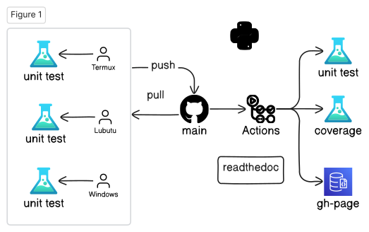
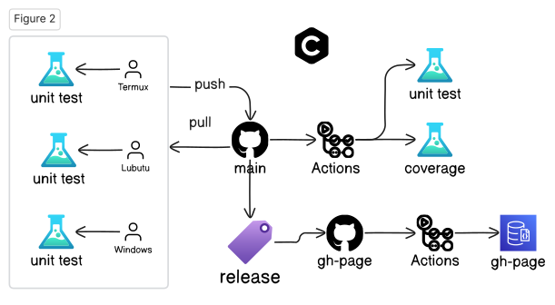
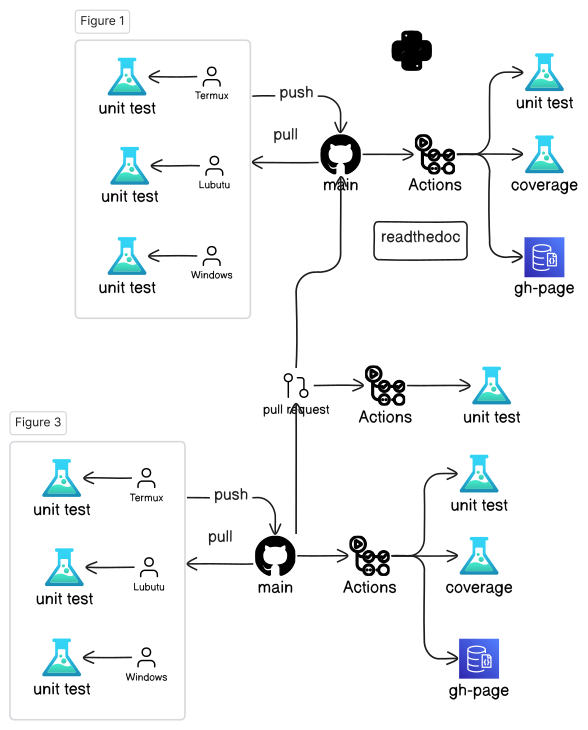

# Lecture 2a: Open-Source Software Development Flow

## 💬 Messages

- About 99% projects fail.
- Software is "soft"; Hardware is "hard"
- Automation is hard
- Nightly build concept (Microsoft)
- Agile software development
- Pair programming
- Extreme programming
- Opensource projects - Continuous Integration

## Platforms

- <https://github.com>
- gitpod.io - ☁️ cloud base
- Github's Codespaces - ☁️ cloud base
- Lubuntu
- Windows - MSVC++
- FydeOS (ChromeOS) - g++-13
- Android's Termux - clang-17

## Open-source Work Flow (Python)



## Open-source Work Flow (C++)



## Pull Request



## GitHub, Git

```bash
git clone https://github.com/luk036/csdigit
cd csdigit
(edit)
git status
git diff
git diff README.md
git pull
git add .
git commit -m "message"
git push
git tag
git branch # list all branches
git branch develop # create a new branch
git switch develop
git switch master
```

## Example - git status

```bash
ubuntu@ubuntu:~/github/ellpy$ git status
On branch master
Your branch is up to date with 'origin/master'.

Changes not staged for commit:
  (use "git add <file>..." to update what will be committed)
  (use "git checkout -- <file>..." to discard changes in working directory)

    <span style="color:red;">modified:   .pytest_cache/v/cache/lastfailed</span>
    <span style="color:red;">modified:   .pytest_cache/v/cache/nodeids</span>

Untracked files:
  (use "git add <file>..." to include in what will be committed)

    <span style="color:red;">ellpy/</span>
    <span style="color:red;">test.html</span>

no changes added to commit (use "git add" and/or "git commit -a")
```

## Example - git pull

```bash
lubuntu@lubuntu:~/github/luk036.github.io$ git pull
remote: Enumerating objects: 29, done.
remote: Counting objects: 100% (29/29), done.
remote: Compressing objects: 100% (8/8), done.
remote: Total 19 (delta 14), reused 16 (delta 11), pack-reused 0
Unpacking objects: 100% (19/19), done.
From ssh://github.com/luk036/luk036.github.io
   461191c..d335266  master     -> origin/master
Updating 461191c..d335266
Fast-forward
 algo4dfm/swdevtips.html  |  36 <span style="color:green;">++++++++</span><span style="color:red;">--</span>
 algo4dfm/swdevtips.md    |  27 <span style="color:green;">+++++++</span><span style="color:red;">-</span>
 algo4dfm/swdevtools.html |  22 <span style="color:green;">+++++</span><span style="color:red;">--</span>
 algo4dfm/swdevtools.md   |  89 <span style="color:green;">++++++++++++++++++++++++</span><span style="color:red;">-</span>
 markdown/remark.html     |  45 <span style="color:green;">++++++++</span><span style="color:red;">-----</span>
 5 files changed, 251 insertions(+), 198 deletions(-)
```

## GitHub, gh

```bash
gh repo create csdigit --public
gh repo clone csdigit
gh run list
gh run view
gh release list
gh release create
gh issue list
gh issue create
gh search repos digraphx
```

## 🐍 Python

- Create a new porject

```bash
pip install pyscaffold[all]
putup -i --markdown --github-actions csdigit
```

- ⚙️ Setup

```bash
cd csdigit
pip install -e .
pip install -r requirements.txt
```

- 🧪 Unit Testing

```bash
pytest
pytest --doctest-modules src
```

- ⛺ Code Coverage

```bash
pytest --cov=src/csdigit
```

## 🐍 Python

- 🪄 Formatting and static check

```bash
pip install pre-commit
pre-commit run --all-files
```

- 📝 Documentation

```bash
pip install -r docs/requirements.txt
cd docs
make html
python -m http.server
```

- 📊 Benchmarking

```bash
pytest benches/test_bench.py
```

## 📊 Benchmarking Example

```bash
ubuntu@ubuntu:~/github/ellpy$ pytest tests/test_lmi.py
<span style="font-weight:bold;">============================= test session starts ==============================</span>
platform linux -- Python 3.7.3, pytest-5.1.2, py-1.8.0, pluggy-0.13.0 -- /media/ubuntu/casper-rw/miniconda3/bin/python
cachedir: .pytest_cache
benchmark: 3.2.2 (defaults: timer=time.perf_counter disable_gc=False min_rounds=5 min_time=0.000005 max_time=1.0 calibration_precision=10 warmup=False warmup_iterations=100000)
rootdir: /media/ubuntu/casper-rw/github/ellpy, inifile: setup.cfg
plugins: benchmark-3.2.2, cov-2.7.1
<span style="font-weight:bold;">collecting ... </span>collected 2 items

tests/test_lmi.py::test_lmi_lazy <span style="color:green;">PASSED</span><span style="color:teal;">                                  [ 50%]</span>
tests/test_lmi.py::test_lmi_old <span style="color:green;">PASSED</span><span style="color:teal;">                                   [100%]</span><span style="color:red;"></span>

<span style="color:olive;">------------ benchmark: 2 tests -----------</span>
Name (time in ms)         Min                Max               Mean            StdDev             Median               IQR            Outliers      OPS            Rounds  Iterations
<span style="color:olive;">-------------------------------------------</span>
test_lmi_lazy       <span style="color:green;"></span><span style="font-weight:bold;color:green;">  13.0504 (1.0)    </span><span style="color:green;"></span><span style="font-weight:bold;color:green;">  13.2587 (1.0)    </span><span style="color:green;"></span><span style="font-weight:bold;color:green;">  13.1461 (1.0)    </span><span style="color:red;"></span><span style="font-weight:bold;color:red;">  0.0432 (1.91)   </span><span style="color:green;"></span><span style="font-weight:bold;color:green;">  13.1471 (1.0)    </span><span style="color:red;"></span><span style="font-weight:bold;color:red;">  0.0514 (1.66)   </span>      25;1<span style="color:green;"></span><span style="font-weight:bold;color:green;">  76.0682 (1.0)    </span>      75           1
test_lmi_old        <span style="color:red;"></span><span style="font-weight:bold;color:red;">  13.6855 (1.05)   </span><span style="color:red;"></span><span style="font-weight:bold;color:red;">  13.7888 (1.04)   </span><span style="color:red;"></span><span style="font-weight:bold;color:red;">  13.7279 (1.04)   </span><span style="color:green;"></span><span style="font-weight:bold;color:green;">  0.0225 (1.0)    </span><span style="color:red;"></span><span style="font-weight:bold;color:red;">  13.7271 (1.04)   </span><span style="color:green;"></span><span style="font-weight:bold;color:green;">  0.0310 (1.0)    </span>      24;1<span style="color:red;"></span><span style="font-weight:bold;color:red;">  72.8445 (0.96)   </span>      72           1
<span style="color:olive;">-------------------------------------------</span>

Legend:
  Outliers: 1 Standard Deviation from Mean; 1.5 IQR (InterQuartile Range) from 1st Quartile and 3rd Quartile.
  OPS: Operations Per Second, computed as 1 / Mean
<span style="color:green;"></span><span style="font-weight:bold;color:green;">============================== 2 passed in 3.27s ===============================</span>
```

## 🦀 Rust

- Create a new project

```bash
cargo install cargo-generate
cargo generate -o --init --git https://github.com/rust-github/template.git
```

- ⚙️ Setup

```bash
cd csd-rs
cargo build
```

- 🧪 Unit Testing

```bash
cargo test
cargo test --lib
cargo test --doc
```

- ⛺ Code Coverage

```bash
cargo tarpaulin (Windows)
```

## 🦀 Rust

- 🪄 Formatting and static check

```bash
cargo fmt
cargo clippy
cargo clippy --fix
```

- 📝 Documentation

```bash
cargo doc
cd target/doc
python -m http.server
```

- 📊 Benchmarking

```bash
cargo bench
```

## C++ (CMake + CPM)

- Create a new project

  Use GitHub's ModernCppStarter template,

- ⚙️ Setup

```bash
cd csd-cpp
cmake -Sall -Bbuild -DCMAKE_BUILD_TYPE=Release
cmake --build build
```

- 🧪 Unit Testing

```bash
cmake --build build --target test
```

- ⛺ Code Coverage

```bash
??
```

## C++ (CMake + CPM)

- 🪄 Formatting and static check

```bash
pip install cmake-format clang-format
cmake -Sall -Bbuild -DCMAKE_BUILD_TYPE=Release
cmake --build build --target fix-format
```

- 📝 Documentation

```bash
cmake --build build --target GenerateDocs
```

- 📊 Benchmarking

```bash
./build/bench/BM_switch
```

## C++ (XMake)

- Create a new project

```bash
xmake create -t static lds-cpp
xmake create -t console csd-cpp
```

- ⚙️ Setup

```bash
xmake f -m debug
xmake
```

- 🧪 Unit Testing

```bash
xmake run test_csd
```

- ⛺ Code Coverage

```bash
??
```

## C++ (XMake)

- 🪄 Formatting and static check

```bash
xmake format
```

- 📝 Documentation

```bash
xmake doxygen
```

- 📊 Benchmarking

```bash
xmake run test_bench
```

# Lecture 2b: Programming in the Age of AI 🤖

## Coding Tips 💡

- Test, test, test!!!
- Write cleaner code
- Refactor repeat codes
- Object oriented programming
- Generic programming
- Design Pattern
- Coroutine is your friend
- Learn from good codes, not bad ones.
- The last rescue: Google search.

## Code generation

- AWS CodeWhisperer (VSCode's extension)
  - generate testing code

## Documentation generation

Mintlify (VSCode's extension)

- Naming
- a, i, p, n ❌
- A x = b
- x: unknown, x_axis
- x, y, z

## Use better variable names

- p: point, polygon, polynomial, prev
- t: time, target, temp
- c: cost, cycle, coefficient
- d: distance, distribution
- e: edge
- v: vertex
- u, v, w: vertex1, vertex2
- i: index
- i, j: row, col
- i, j, k
- l, m: line1, line2
- n: dimension, node, next
- n, m: ndim, mdim
- w: weight, frequence (omega)

## 🚀 Performance Tips 💡

- Avoid string comparison
- Use sentinel
- Use cheaper measure, avoid `sqrt()`, `sin()`, `cos()`
- Lazy evaluation
- Table lookup
- Avoid sequence search:
  - Backward pointers
  - Hash Table/Dictionary/Map

## Avoid string comparison

Bad 👎:

```python
if pin == "input":
    # ...
elif pin == "output":
    # ...
elif pin == "in_out":
    # ...
elif pin == "dont_care":
    # ...
else:
    # ...
```

Better ⚡:

```python
pin_type = dict({"input":0},
  {"output":1}, {"in_out":2},
  {"dont_care":3})
...
id = pin_type.get(pin, -1)
if id == 0:
    # ...
elif id == 1:
    # ...
elif id == 2:
    # ...
elif id == 3:
    # ...
else:
    # ...
```

## Use Sentinel

Bad 👎:

```python
max = 0
bckt = [Dllist() for _ in range(high)]
# ...
def popleft():
    res = bckt[max].popleft()
    while max >= 0 and bckt[max].empty():
        max -= 1
    return res
```

Better ⚡:

```python
max = 0
sentinel = Dllink()
bckt = [Dllist() for _ in range(high+1)]
bckt[0].append(sentinel)  # sentinel
# ...
def popleft():
    res = bckt[max].popleft()
    while bckt[max].empty():
        max -= 1
    return res
# Saved a boundary check `max >= 0`
```

## Use cheaper measure

Bad 👎:

```python
mind = 10000
maxd = 0
for u, v in G.edges():
    t = vec[u] - vec[v]
*   d = sqrt(t.dot(t))
    if mind > d: mind = d
    if maxd < d: maxd = d
*return maxd - mind
```

Better ⚡:

```python
minq = 10000
maxq = 0
for u, v in G.edges():
    t = vec[u] - vec[v]
*   q = t.dot(t)
    if minq > q: minq = q
    if maxq < q: maxq = q
*return sqrt(maxq) - sqrt(minq)
```

## Another Example

Bad 👎:

```python
mind = 10000
maxd = 0
for u, v in G.edges():
*   t = 1 - vec[u].dot(vec[v])
*   d = arcsin(sqrt(t))
    if mind > d: mind = d
    if maxd < d: maxd = d

*return maxd - mind
```

Better ⚡:

```python
minq = 10000
maxq = 0
for u, v in G.edges():
*   q = 1 - vec[u].dot(vec[v])
    if minq > q: minq = q
    if maxq < q: maxq = q

*return arcsin(sqrt(maxq)) \
*        - arcsin(sqrt(minq))
```

## Optimization Tips 💡

- Convex optimization

- Network optimization

- Primal-dual paradigm
