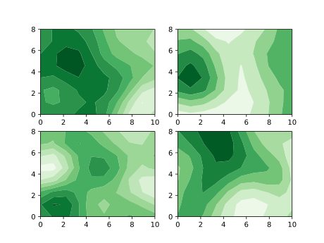
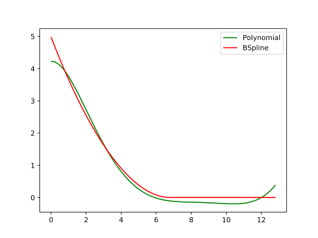
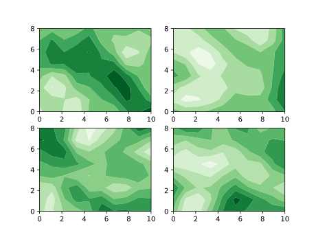
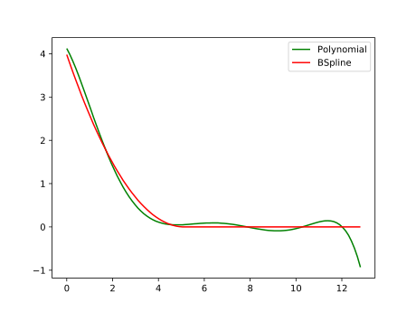
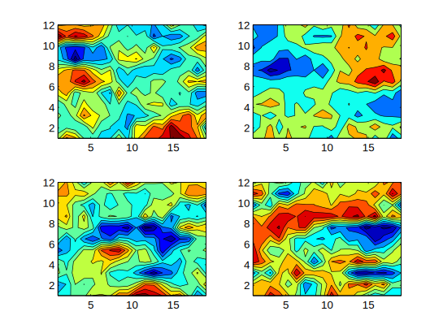
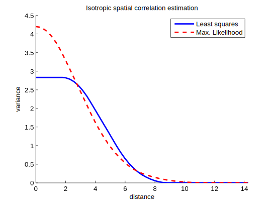

# Non-Parametric Spatial Correlation Estimation

## Abstract

This lecture discusses non-parametric spatial correlation estimation and its importance in analyzing the variability in semiconductor devices. The intra-die variation in these devices can exhibit spatially correlated patterns, which require accurate statistical analysis during the design stage. Anisotropic models are used to allow for variations in gate length, which exhibit stronger correlation in the horizontal direction than the vertical direction. Non-parametric approaches make sense for correlation functions, as earlier studies that used parametric forms were limited by the assumptions made about the correlation function. This lecture goes on to describe random fields and the properties of correlation functions before diving into problem formulation and solutions using maximum likelihood estimation and least squares estimation.

## 🗺️ Overview

- Motivation:
  - Why is spatial correlation important?
  - Why anisotropic models?
  - Why do non-parametric approaches make sense?
- Problem Formulation
- Non-parametric estimation
  - Least squares estimation
  - Maximum Likelihood estimation
- Numerical experiment
- Conclusion

## Why Spatial Correlation?

- As the minimum feature size of semiconductor devices continues to shrink,
  - Process variations are inevitable. It is desirable to develop more accurate statistical analysis during the design stage.
- Intra-die variation exceeds inter-die variation
  - Becomes dominant over total process variation
  - Often exhibits spatially correlated patterns.
- Applications:
  - Statistical timing analysis -\> Clock Skew Scheduling
  - Power/leakage minimization

## Why Anisotropic Model?

- Isotropic assumption assumes that the correlation depends only on the distance between two random variables. It was made to simplify the computation.
- Certain variations, such variations in gate length, exhibit significantly stronger correlation in the horizontal direction than in the vertical direction.

## Why Non-Parametric Approaches?

- In earlier studies, the parametric form of the correlation function was simple, such as an exponential, Gaussian or Matérn function:
- Pros: guaranteed to be **positive definite**.
- Cons:
  - non-convex; may be stuck in a local minimum
  - The actual correlation function may not necessarily be of this form.
  - isotropic model

## Related research

- Piecewise linearization method (imprecise, not positive definite)
- Parametric method (non-convex, too smooth, isotropic)
  - Exponential function
  - Gaussian function
  - Matérn function
- Non-parametric method
  - Polynomial fitting
  - B-spline

## Random Field

- Random field is an indexed family of random variables denote as
  $\{\tilde{z}(s): s \in D\}$, where $D \subseteq \mathrm{R}^d$
- Covariance $C(s_i, s_j)$ = $\text{cov}(\tilde{z}(s_i),\tilde{z}(s_j))$ =
  $\mathrm{E}[(\tilde{z}(s_i) - \mathrm{E}[\tilde{z}(s_i)]) (\tilde{z}(s_j) - \mathrm{E}[\tilde{z}(s_j)])]$
- Correlation
  $R(s_i, s_j) = C(s_i, s_j)/\sqrt{C(s_i, s_i) C(s_j, s_j)}$
- The field is stationary, or homogeneous, if the distribution is
  unchanged when the point set is translated.
- The field is isotropic if the distribution is invariant under any
  rotation.
- In HIF, let $d = \| s_i - s_j \|_2$:
  - $C(s_i, s_j) = C(d)$
  - $R(s_i, s_j) = C(d)/C(0) = \sigma^2 \rho(d)$

## Properties of Correlation Function

- Even function, i.e. $\rho(\vec{h}) = \rho(-\vec{h}) \implies$ its Fourier transform
  is real.
- Positive definiteness (PD) $\implies$ its Fourier transform is positive
  (Bochner's theorem).
- Monotonicity: correlations are decreasing against $h$ 🤔
- Nonnegativeness: no negative correlation 🤔
- Discontinuity at the origin: nugget effect.

The nugget effect refers to the discontinuity at the origin in the correlation function of spatially correlated patterns. It indicates the presence of a small, non-zero correlation value between points that are very close to each other. In other words, it represents the variance component that cannot be explained by spatial correlation and is attributed to purely random variation.

## Problem Formulation

- Intra-die variation
  $\tilde{z} = z_{det} + \tilde{z}_{cor} + \tilde{z}_{rnd}$
  - $z_{det}$: deterministic component
  - $\tilde{z}_{cor}$: correlated random component
  - $\tilde{z}_{rnd}$: purely random component
- Given $M$ samples $(z_1, z_2, \ldots, z_M) \in \mathbb{R}^n$.
- Measured covariance matrix $Y$:
  - $Y = (1/M) \sum_{i=1}^M z_i z_i^\mathsf{T}$ (unlikely PD)
- In MATLAB, simply call `cov(Zs',1)` to obtain $Y$.
- In Python, simple call `np.cov(Zs, bias=True)` to obtain $Y$.

## Nearest PD Matrix Problem

- Given $Y$. Find a nearest matrix $\Sigma$ that is positive definite.
  $$
  \begin{array}{ll}
      \text{minimize}   & \| \Sigma - Y \|_F \\
      \text{subject to} & \Sigma \succeq 0
    \end{array}$$ where $\| \Sigma - Y \|_F$ denotes the Frobenius
  norm, $A \succeq 0$ denotes $A$ is positive semidefinite.
  $$
- 👉 Note:
  1.  the problem is convex 😃
  2.  the problem can be solved easily using CVX 😃

## Maximum Likelihood Estimation

- Maximum likelihood estimation (MLE): $$\begin{array}{ll}
        \text{maximize}   & \log \det \Sigma^{-1} - \mathrm{Tr}(\Sigma^{-1}Y)  \\
        \text{subject to} & \Sigma \succeq 0
      \end{array}$$ where $\mathrm{Tr}(A)$ denotes the trace of $A$.
- 👉 Note: 1st term is concave 😭, 2nd term is convex

## Maximum Likelihood Estimation (cont'd)

- Having $S = \Sigma^{-1}$, the problem becomes convex 😃:
  $$
  \begin{array}{ll}
      \text{minimize}   &   -\log \det S + \mathrm{Tr}(S Y) \\
      \text{subject to} & S \succeq 0
    \end{array}
  $$
- 👉 Note: the problem can be solved easily using MATLAB with the CVX
  package, or using Python with the cvxpy package.

## Matlab Code of CVX

```matlab
function Sig = log_mle_solver(Y);
ndim = size(Y,1);
cvx_quiet(false);
cvx_begin sdp
    variable S(ndim, ndim) symmetric
    maximize(log_det(S) - trace(S*Y))
    subject to
         S >= 0;
cvx_end
Sig = inv(S);
```

## 🐍 Python Code

```python
from cvxpy import *
from scipy import linalg

def mle_corr_mtx(Y):
  ndim = len(Y)
  S = Semidef(ndim)
  prob = Problem(Maximize(log_det(S) - trace(S*Y)))
  prob.solve()
  if prob.status != OPTIMAL:
      raise Exception('CVXPY Error')
  return linalg.inv(S.value)
```

## Correlation Function (I)

- Let $\rho(h) = \sum_i^m p_i \Psi_i(h)$, where

  - $p_i$'s are the unknown coefficients to be fitted
  - $\Psi_i$'s are a family of basis functions.

- Let $\{F_k\}_{i,j} =\Psi_k( \| s_i - s_j \|_2)$.

- The covariance matrix $\Omega(p)$ can be recast as:
  $$\Omega(p) = p_1 F_1 + \cdots + p_m F_m$$

- Note 1: affine transformation preserved convexity

- Note 2: inverse of matrix unfortunately **cannot** be expressed in
  convex form.

## Correlation Function (II)

- Choice of $\Psi_i(h)$:
  - Polynomial $P_i(h)$:
    - Easy to understand 👍
    - No guarantee of monotonicity; unstable for higher-order polynomials.
  - B-spline function $B_i(h)$
    - Shapes are easier to control 👍
    - No guarantee of positive definite 👎

## Correlation Function (III)

- To ensure that the resulting function is PD, additional constraints can be imposed according to Bochner's theorem, e.g.:
  - real(FFT($\{\Psi_i(h_k)\}$)) $\geq 0$

Bochner's theorem states that a continuous function is a valid covariance function if and only if its Fourier transform is a non-negative measure. In other words, a function can be a valid covariance function if and only if its Fourier transform is positive definite. This theorem is important in spatial statistics because it provides a way to check whether a given covariance function is valid or not.

## Non-Parametric Estimation

- Least squares estimation

  $$
  \begin{array}{ll}
    \min_{\kappa, p}   & \| \Omega(p) + \kappa I - Y \|_F \\
    \text{s.t.} & \Omega(p) \succeq 0,  \kappa \geq 0
  \end{array}
  $$

  👉 Note: convex problem 😃

- Maximum likelihood estimation (MLE):
  $$
  \begin{array}{ll}
    \min_{\kappa, p}   &      \log \det (\Omega(p) + \kappa I) + \mathrm{Tr}((\Omega(p) + \kappa I)^{-1}Y) \\
    \text{s.t.} & \Omega(p) \succeq 0, \kappa \geq 0
  \end{array}
  $$
  👉 Note:
  - The 1st term is concave 😭, the 2nd term is convex
  - However, the problem is **geodesically convex**.
  - If enough samples are available, then $Y \succeq 0$. Furthermore, the
    MLE is a convex problem in
    $Y \preceq \Omega(p) + \kappa I \preceq 2Y$

## Isotopic Case I


: Data Sample


: Least Square Result

## Isotopic Case II


: Data Sample


: Least Square Result

## Convex Concave Procedure

- Let $\Sigma = \Omega + \kappa I$. Log-likelihood function is:
  - $\log \det \Sigma^{-1} - \mathrm{Tr}(\Sigma^{-1}Y)$
- Convexify the first term using the fact:
  - $\log \det \Sigma^{-1} \geq \log \det \Sigma_0^{-1} + \mathrm{Tr}(\Sigma_0^{-1} (\Sigma - \Sigma_0))$
  - minimize:
    $-\log \det \Sigma_0^{-1} + \mathrm{Tr}(\Sigma_0^{-1} (\Sigma - \Sigma_0)) + \mathrm{Tr}(\Sigma^{-1}Y)$
- At each iteration $k$, the following convex problem is solved:
  $$
  \begin{array}{ll}
      \min   &  \mathrm{Tr}(\Sigma_k^{-1} (\Sigma - \Sigma_k)) + \mathrm{Tr}(SY) \\
      \text{s.t.} & \left(
      \begin{array}{cc}
    \Sigma &  I_n \\
     I_n & S
      \end{array}
    \right)
          \succeq 0, \kappa \geq 0
    \end{array}
  $$
  👉 Note: Convergence to an optimal solution is not guaranteed, but is practically good.

## MATLAB Code

```matlab
% Geometric anisotropic parameters
alpha = 2;     % scaling factor
theta = pi/3;  % angle
Sc = [1   0; 0   alpha];
R = [sin(theta) cos(theta); -cos(theta) sin(theta)];
T = Sc*R;
Sig = ones(n,n);
for i=1:n-1,
   for j=i+1:n,
     dt = s(j,:)' - s(i,:)';
     d = T*dt;  % become isotropic after the location transformation
     Sig(i,j) = exp(-0.5*(d'*d)/(sdkern*sdkern)/2);
     Sig(j,i) = Sig(i,j);
   end
end
```

## Anisotopic Data



## Isotropic Result



## Anisotropic Result


## Future Work

- Porting MATLAB code to Python
- Real data, not computer generated data
- Barycentric B-spline.
- Sampling method optimization.
