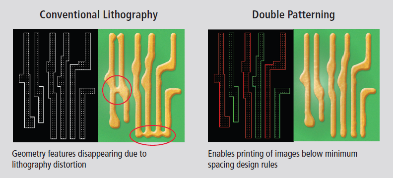
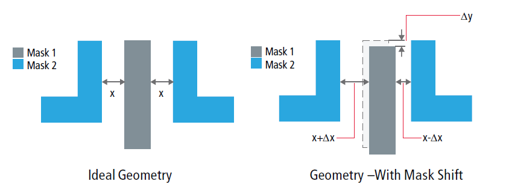
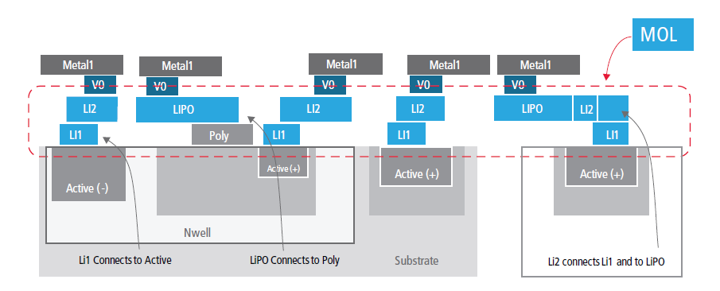
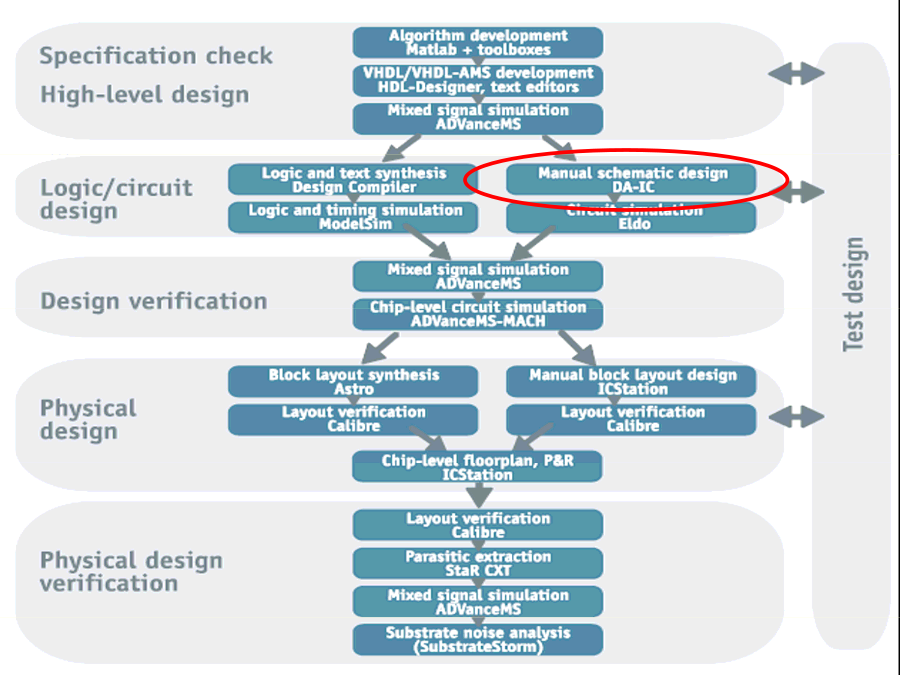
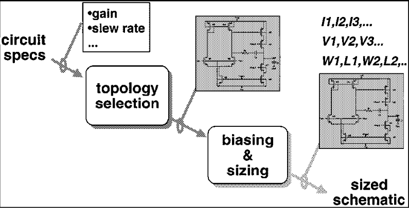
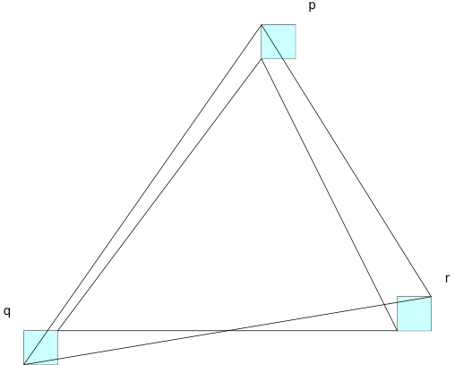
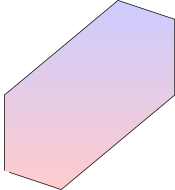
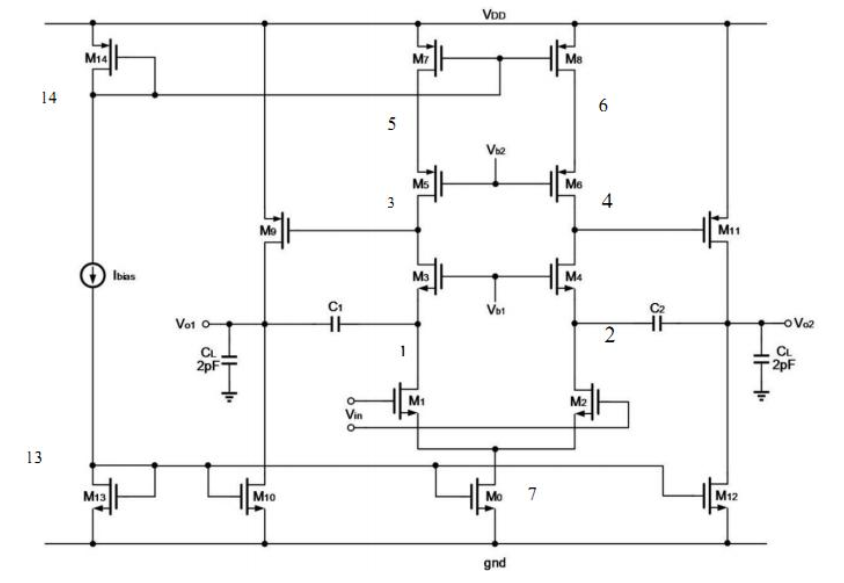

# Lecture 4: Robust Analog Circuit Sizing Under Process Variations

@luk036

2022-10-12

## 📝 Abstract

The lecture focuses on the robust sizing of analog circuits under process variations. It analyzes the challenges that arise when designing analog circuits at the 20nm process node, including double-patterning, layout-dependent effects, new local interconnect layers, and the use of FinFET transistors. The lecture stresses the importance of designing circuits with robustness in mind by factoring in process variations in the specification requirements. The lecture presents the concept of formulating the analog circuit sizing problem and identifies the difficulties involved, such as the high level of flexibility and susceptibility to variations. The lecture also explores various approaches to computer-aided design (CAD) for analog circuits, including knowledge-based and optimization-based techniques. The lecture discusses emerging techniques in geometric programming (GP), introducing a new method for solving robust GP problems using the affine arithmetic and the ellipsoid technique. An example of CMOS two-stage operational amplifier design demonstrates the application of the robust geometric programming approach.

## 🔑 Keywords

-   Analog circuit 模拟电路
-   Design for robustness 鲁棒性设计
-   Worst-case scenarios 最坏情景
-   Affine arithmetic 仿射运算
-   Convex programming 凸规划
-   Geometric programming 几何规划
-   Posynomial 正项式 (Positive + polynomial)
-   Ellipsoid method 椭球法

## 🗺️ Overview

-   Challenges of 20nm Analog Design

-   Design for variability

-   Design for robustness

-   Analog circuit sizing problem formulation

-   Robust geometric programming

-   Affine arithmetic for worst case scenarios

-   Design examples

## 📖 Introduction

  Costs          28nm        20nm
  -------------- ----------- -------------
  Fab Costs      3B          4B - 7B
  Process R&D    1.2B        2.1B - 3B
  Mask Costs     2M - 3M     5M - 8M
  Design Costs   50M - 90M   120M - 500M

  : Fab, process, mask, and design costs are much higher at 20nm (IBS,
  May 2011)

## Challenges at 20 nm

-   Double-patterning aware

-   Layout-dependent effects

-   New local interconnect layers

-   \>5,000 design rules

-   Device variation and sensitivity

-   New type of transistor - FinFET

## Double Patterning



## Overlay Error (Mask Shift)

-   Parasitic matching becomes very challenging

    

## Layout-Dependent Effects

| Layout-Dependent Effects      | \> 40nm | At 40nm | \>= 28nm |
| ----------------------------- | :-----: | :-----: | :------: |
| Well Proximity Effect (WPE)   |    x    |    x    |    x     |
| Poly Spacing Effect (PSE)     |         |    x    |    x     |
| Length of Diffusion (LOD)     |    x    |    x    |    x     |
| OD to OD Spacing Effect (OSE) |         |    x    |    x     |

## New Local Interconnect Layers



## New Transistor Type: FinFET


## Design for Robustness

-   Process variations must be included in the specification.

## Basic Design Flow





## Top-down Design Phases


## Basic Flow of Analog Synthesis



## Analog Circuit Sizing Problem

-   Problem definition:
    -   Given a circuit topology, a set of specification requirements and technology, find the values of design variables that meet the specifications and optimize the circuit performance.
-   Difficulties:
    -   High degrees of freedom
    -   Performance is sensitive to variations

## Main Approaches in CAD

-   Knowledge-based
    -   Rely on circuit understanding, design heuristics
-   Optimization based
    -   **Equation based**
        -   Establish circuit equations and use numerical solvers
    -   Simulation based
        -   Rely on circuit simulation

In practice, you mix and match of them whenever appropriate.

## Geometric Programming

-   In recent years, techniques of using geometric programming (GP) are emerging.
-   In this lecture, we present a new idea of solving robust GP problems using **ellipsoid method** and **affine arithmetic**.

# Lecture 04b - Robust Geometric Programming

## Outline

-   Problem Definition for Robust Analog Circuit Sizing
-   Robust Geometric Programming
-   Affine Arithmetic
-   Example: CMOS Two-stage Op-Amp
-   Numerical Result
-   Conclusions

## Robust Analog Circuit Sizing Problem

-   Given a circuit topology and a set of specification requirements:


| Constraint     | Spec.      | Units      |
| -------------- | ---------- | ---------- |
| Device Width   | $\geq 2.0$ | $\mu$m     |
| Device Length  | $\geq 1.0$ | $\mu$m     |
| Estimated Area | minimize   | $\mu$m$^2$ |
| $\vdots$       | $\vdots$   | $\vdots$   |
| CMRR           | $\geq 75$  | dB         |
| Neg. PSRR      | $\geq 80$  | dB         |
| Power          | $\leq 3$   | mW         |


-   Find the worst-case design variable values that meet the specification requirements and optimize circuit performance.

## Robust Optimization Formulation

-   Consider $$\begin{array}{ll}
        \text{minimize}   & \sup_{q \in {\mathbb{Q} }} f_0(x,q), \\
        \text{subject to} & f_j(x,q) \leq 0 \qquad \\
        & \forall q \in {\mathbb{Q} } \; \text{and} \; j = 1,2,\cdots,m, \\
      \end{array}$$ where
    -   $x \in {\mathbb{R} }^n$ represents a set of design variables
        (such as $L$, $W$),
    -   $q$ represents a set of varying parameters (such as $T_{OX}$)
    -   $f_j \leq 0$ represents the $j$th specification requirement (such
        as phase margin $\geq 60^\circ$).

## Geometric Programming in Standard Form

-   We further assume that $f_i(x,q)$'s are convex for all $q \in {\mathbb{Q} }$.
-   Geometric programming is an optimization problem that takes the following standard form:
    $$\begin{array}{lll}
        \text{minimize}   & p_0(y) &  \\
        \text{subject to} & p_i(y) \leq 1, & i=1,\ldots,l  \\
          & g_j(y) = 1, & j=1,\ldots,m  \\
          & y_k > 0,& k=1,\ldots,n ,
      \end{array}$$ where
    -   $p_i$'s are posynomial functions and $g_j$'s are monomial functions.

## Posynomial and Monomial Functions

-   A monomial function is simply:
    $$g(y_1,\ldots,y_n) = c y_1^{ {\alpha}_{1} } y_2^{ {\alpha}_{2} } \cdots y_n^{ {\alpha}_{n} }, \quad y_k > 0.$$
    where
    -   $c$ is non-negative and ${\alpha}_{k}\in {\mathbb{R} }$.
-   A posynomial function is a sum of monomial functions:
    $$p(y_1,\ldots,y_n) = \sum_{s=1}^{T}{c_s y_1^{ {\alpha}_{1,s} } y_2^{ {\alpha}_{2,s} } \cdots y_n^{ {\alpha}_{n,s} }}, \quad y_k > 0 ,$$
-   A monomial can also be viewed as a special case of posynomial where there is only one term of the sum.

## Geometric Programming in Convex Form

-   Many engineering problems can be formulated as a GP.
-   On Boyd's website there is a Matlab package "GGPLAB" and an excellent tutorial material.
-   GP can be converted into a convex form by changing the variables $x_k = \log(y_k)$ and replacing $p_i$ with $\log p_i$:
    $$\begin{array}{lll}
          \text{minimize}   & \log p_0(\exp(x)) &  \\
          \text{subject to} & \log p_i(\exp(x)) \leq 0, & i=1,\ldots,l \\
          & a_j^\mathsf{T} x + b_j = 0, & j=1,\ldots,m
      \end{array}$$
    where
    -   $\exp(x) = (e^{x_1}, e^{x_2}, \cdots, e^{x_n})$
    -   $a_j = (\alpha_{1,j}, \cdots, \alpha_{n,j})$
    -   $b_j = \log(c_j)$

## Robust GP

-   GP in the convex form can be solved efficiently by interior-point methods.
-   In robust version, coefficients $c_s$ are functions of $q$.
-   The robust problem is still convex. Moreover, there is an infinite number of constraints.
-   Alternative approach: Ellipsoid Method.

## Example - Profit Maximization Problem

This example is taken from [@Aliabadi2013Robust].

$$\begin{array}{ll}
   \text{maximize} & p(A x_1^\alpha x_2^\beta) - v_1 x_1 - v_2 x_2 \\
   \text{subject to}& x_1 \le k.
\end{array}$$

-   $p(A x_1^\alpha x_2^\beta)$ : Cobb-Douglas production function
-   $p$: the market price per unit
-   $A$: the scale of production
-   $\alpha, \beta$: the output elasticities
-   $x$: input quantity
-   $v$: output price
-   $k$: a given constant that restricts the quantity of $x_1$

## Example - Profit maximization (cont'd)

-   The formulation is not in the convex form.
-   Rewrite the problem in the following form: $$\begin{array}{ll}
      \text{maximize} & t \\
      \text{subject to} & t  + v_1 x_1  + v_2 x_2 \le p A x_1^{\alpha} x_2^{\beta}\\
                    & x_1 \le k.
      \end{array}$$

## Profit maximization in Convex Form

-   By taking the logarithm of each variable:

    -   $y_1 = \log x_1$, $y_2 = \log x_2$.

-   We have the problem in a convex form:

$$\begin{array}{ll}
    \text{max}  & t \\
    \text{s.t.} & \log(t + v_1 e^{y_1} + v_2 e^{y_2}) - (\alpha y_1 + \beta y_2) \le \log(pA) \\
                & y_1 \le \log k.
\end{array}$$


``` python
class profit_oracle:
    def __init__(self, params, a, v):
        p, A, k = params
        self.log_pA = np.log(p * A)
        self.log_k = np.log(k)
        self.v = v
        self.a = a

    def __call__(self, y, t):
        fj = y[0] - self.log_k  # constraint
        if fj > 0.:
            g = np.array([1., 0.])
            return (g, fj), t
        log_Cobb = self.log_pA + self.a @ y
        x = np.exp(y)
        vx = self.v @ x
        te = t + vx
        fj = np.log(te) - log_Cobb
        if fj < 0.:
            te = np.exp(log_Cobb)
            t = te - vx
            fj = 0.
        g = (self.v * x) / te - self.a
        return (g, fj), t
```


``` python
# Main program

import numpy as np
from ellpy.cutting_plane import cutting_plane_dc
from ellpy.ell import ell
from .profit_oracle import profit_oracle

p, A, k = 20., 40., 30.5
params = p, A, k
alpha, beta = 0.1, 0.4
v1, v2 = 10., 35.
a = np.array([alpha, beta])
v = np.array([v1, v2])
y0 = np.array([0., 0.])  # initial x0
r = np.array([100., 100.])  # initial ellipsoid (sphere)
E = ell(r, y0)
P = profit_oracle(params, a, v)
yb1, ell_info = cutting_plane_dc(P, E, 0.)
print(ell_info.value, ell_info.feasible)
```


## Example - Profit Maximization Problem (convex)

$$\begin{array}{ll}
\text{max}  & t \\
\text{s.t.} & \log(t + \hat{v}_1 e^{y_1} + \hat{v}_2 e^{y_2}) - (\hat{\alpha} y_1 + \hat{\beta} y_2) \le \log(\hat{p}\,A)  \\
                  & y_1 \le \log \hat{k} ,
\end{array}$$

-   Now assume that:
    -   $\hat{\alpha}$ and $\hat{\beta}$ vary $\bar{\alpha} \pm e_1$ and
        $\bar{\beta} \pm e_2$ respectively.
    -   $\hat{p}$, $\hat{k}$, $\hat{v}_1$, and $\hat{v}_2$ all vary
        $\pm e_3$.

## Example - Profit Maximization Problem (oracle)

By detail analysis, the worst case happens when:

-   $p = \bar{p} - e_3$, $k = \bar{k} - e_3$
-   $v_1 = \bar{v}_1 + e_3$, $v_2 = \bar{v}_2 + e_3$,
-   if $y_1 > 0$, $\alpha = \bar{\alpha} - e_1$, else
    $\alpha = \bar{\alpha} + e_1$
-   if $y_2 > 0$, $\beta = \bar{\beta} - e_2$, else
    $\beta = \bar{\beta} + e_2$

``` python
class profit_rb_oracle:
    def __init__(self, params, a, v, vparams):
        e1, e2, e3, e4, e5 = vparams
        self.a = a
        self.e = [e1, e2]
        p, A, k = params
        params_rb = p - e3, A, k - e4
        self.P = profit_oracle(params_rb, a, v + e5)

    def __call__(self, y, t):
        a_rb = self.a.copy()
        for i in [0, 1]:
            a_rb[i] += self.e[i] if y[i] <= 0 else -self.e[i]
        self.P.a = a_rb
        return self.P(y, t)
```

## Oracle in Robust Optimization Formulation

-   The oracle only needs to determine:
    -   If $f_j(x_0, q) > 0$ for some $j$ and $q = q_0$,
        then
        -   the cut $(g, \beta)$ =
            $(\partial f_j(x_0, q_0), f_j(x_0, q_0))$
    -   If $f_0(x_0, q) \geq t$ for some
        $q = q_0$, then
        -   the cut $(g, \beta)$ =
            $(\partial f_0(x_0, q_0), f_0(x_0, q_0) - t)$
    -   Otherwise, $x_0$ is feasible, then
        -   Let
            $q_{\max} = \text{argmax}_{q \in \mathbb Q} f_0(x_0, q)$.
        -   $t := f_0(x_0, q_{\max})$.
        -   The cut $(g, \beta)$ =
            $(\partial f_0(x_0, q_{\max}), 0)$

Remark:

-   for more complicated problems, affine arithmetic could be used [@liu2007robust].

# Lecture 04c - Affine Arithmetic

## A Simple Area Problem

-   Suppose the points $p$, $q$ and $r$ vary within the region of 3 given rectangles.
-   Q: What is the upper and lower bound on the area of $\triangle pqr$?





## Method 1: Corner-based

-   Calculate all the areas of triangles with different *corners*.
-   Problems:
    -   In practical applications, there may be many corners.
    -   What's more, in practical applications, the worst-case scenario may not be at the corners at all.

## Method 2: Monte Carlo

-   Monte-Carlo or Quasi Monte-Carlo:
    -   Calculate the area of triangles for different sampling points.
-   Advantage: more accurate when there are more sampling points.
-   Disadvantage: time consuming


# Interval Arithmetic vs. Affine Arithmetic

## Method 3: Interval Arithmetic

-   Interval arithmetic (IA) estimation:
    -   Let px = \[2, 3\], py = \[3, 4\]
    -   Let qx = \[-5, -4\], qy = \[-6, -5\]
    -   Let rx = \[6, 7\] , ry = \[-5, -4\]
-   Area of triangle:
    -   = ((qx - px)(ry - py) - (qy - py)(rx - px))/2
    -   = \[33 .. 61\] (actually \[36.5 .. 56.5\])
-   Problem: cannot handle *correlation* between variables.

## Method 4: Affine Arithmetic

-   (Definition to be given shortly)
-   More accurate estimation than IA:
    -   Area = \[35 .. 57\] in the previous example.
-   Take care of first-order correlation.
-   Usually faster than Monte-Carlo, but ....
    -   becomes inaccurate if the variations are large.
-   libaffa.a/YALAA package is publicly available:
    -   Provides functuins like +, -, \*, /, sin(), cos(), pow() etc.

## Analog Circuit Example

-   Unit Gain bandwidth
    -   `GBW = sqrt(A*Kp*Ib*(W2/L2)/(2*pi*Cc)` where some parameters are varying

## Enabling Technologies

-   C++ template and operator overloading features greatly simplify the coding effort:

-   E.g., the following code can be applied to both `<double>` and `<AAF>`:

    ``` cpp
    template <typename Tp>
    Tp area(const Tp& px, const Tp& qx, const Tp& rx,
            const Tp& py, const Tp& qy, const Tp& ry) {
        return ((qx-px)*(ry-py) - (qy-py)*(rx-px)) / 2;
    }
    ```

-   In other words, some existing code can be reused with minimal modification.

## Applications of AA

-   Analog Circuit Sizing
-   Worst-Case Timing Analysis
-   Statistical Static Timing Analysis
-   Parameter Variation Interconnect Model Order Reduction \[CMU02\]
-   Clock Skew Analysis
-   Bounded Skew Clock Tree Synthesis

## Limitations of AA

-   Something AA can't replace `<double>`:
    -   Iterative methods (no fixed point in AA)
    -   No Multiplicative inverse operation (no LU decomposition)
    -   Not total ordering, can't sort (???)
-   AA can only handle linear correlation, which means you can't expect an accurate approximation of `abs(x)` near zero.
-   Fortunately the ellipsoid method is one of the few algorithms that works with AA.

## Circuit Sizing for Op. Amp.

-   Geometric Programming formulation for CMOS Op. Amp.
-   Min-max convex programming under Parametric variations (PVT)
-   Ellipsoid Method

## What is Affine Arithmetic?

-   Represents a quantity x with an affine form (AAF):
    $$\hat{x} = x_0 + x_1 \epsilon_1 + \ldots + x_n \epsilon_n$$ where
    -   noise symbols $\epsilon_i \in [-1, 1]$
    -   central value $x_0 \in \mathbb{R}$
    -   partial deviations $x_i \in \mathbb{R}$
    -   $n$ is not fixed - new noise symbols are generated during the computation process.
-   IA -\> AA : $[3..4] \rightarrow 3.5 + 0.5 \epsilon_1$

## Geometry of AA


-   Affine forms that share noise symbols are dependent:
    -   $\hat{x} = x_0 + x_1 \epsilon_1 + \ldots + x_n \epsilon_n$
    -   $\hat{y} = y_0 + y_1 \epsilon_1 + \ldots + y_m \epsilon_m$
-   The region containing (x, y) is:
    -   $Z = \{(x, y) : \epsilon_i \in [-1, 1]\}$
    -   This region is a centrally symmetric convex polygon called "zonotope".





## Affine Arithmetic

How to find $\sup_{q \in {\mathbb{Q} }} f_j(x,q)$ efficiently?

-   $\sup_{q \in {\mathbb{Q} }} f_j(x,q)$ is in general difficult to obtain.
-   Provided that variations are small or nearly linear, we propose using Affine Arithmetic (AA) to solve this problem.
-   Features of AA:
    -   Handle correlation of variations by sharing *noise symbols*.
    -   Enabling technology: template and operator overloading features of C++.
    -   A C++ package "YALAA" is publicly available.

## Affine Arithmetic for Worst Case Analysis

-   An uncertain quantity is represented in an affine form (AAF):
    $$\hat{a} = a_0 + a_1 \varepsilon_1 + a_2 \varepsilon_2 +
      \cdots +  a_k \varepsilon_k = a_0 + \sum_{i=1}^{k} a_i \varepsilon_i,$$
    where
    -   $\varepsilon_i \in [-1, 1]$ is called *noise symbol*.
-   Exact results for affine operations ($\hat{a}+\hat{b}$,
    $\hat{a}-\hat{b}$ and $\alpha \cdot \hat{a}$)
-   Results of non-affine operations (such as $\hat{a} \cdot \hat{b}$, $\hat{a}/\hat{b}$, $\max(\hat{a}, \hat{b}), \log(\hat{a})$) are *approximated* in an affine form.
-   AA has been applied to a wide range of applications recently when process variations are considered.

## Affine Arithmetic for Optimization

In our robust GP problem:

-   First, represent every elements in $q$ in affine forms.
-   For each ellipsoid iteration, $f(x_c,q)$ is obtained by *approximating* $f(x_c,\hat{q})$ in an affine form:
    $$\hat{f} = f_0 + f_1 \varepsilon_1 + f_2 \varepsilon_2 + \cdots +  f_k \varepsilon_k.$$
-   Then the maximum of $\hat{f}$ is determined by:
    $$\varepsilon_j = \left\{ \begin{array}{ll}
                  +1 & \qquad \text{if} \; f_j > 0 \\
                  -1 & \qquad \text{if} \; f_j < 0
                \end{array}
      \right.   \quad j=1, \cdots, k.$$





## Performance Specification


| Constraint       | Spec.         | Units         |
| ---------------- | ------------- | ------------- |
| Device Width     | $\geq 2.0$    | $\mu$m        |
| Device Length    | $\geq 1.0$    | $\mu$m        |
| Estimated Area   | minimize      | $\mu$m$^2$    |
| Input CM Voltage | $[0.45,0.55]$ | x $V_{DD}$    |
| Output Range     | $[0.1,0.9]$   | x $V_{DD}$    |
| Gain             | $\geq 80$     | dB            |
| Unity Gain Freq. | $\geq 50$     | MHz           |
| Phase Margin     | $\geq 60$     | degree        |
| Slew Rate        | $\geq 50$     | V/$\mu$s      |
| CMRR             | $\geq 75$     | dB            |
| Neg. PSRR        | $\geq 80$     | dB            |
| Power            | $\leq 3$      | mW            |
| Noise, Flicker   | $\leq 800$    | nV/Hz$^{0.5}$ |


## Open-Loop Gain (Example)

-   Open-loop gain $A_v$ can be approximated as a monomial function:

    $$A_v =  \frac{2 C_{ox} }{(\lambda_n + \lambda_p)^2} \sqrt{\mu_n \mu_p \frac{W_1 W_6}{L_1 L_6 I_1 I_6} }$$

    where $I_1$ and $I_6$ are monomial functions.

-   Corresponding C++ code fragment:

    ``` cpp
    // Open Loop Gain
    monomial<aaf> OLG = 2*COX/square(LAMBDAN+LAMBDAP)*
         sqrt(KP*KN*W[1]/L[1]*W[6]/L[6]/I1/I6);
    ```

## Results of Design Variables


| Variable   | Units  | GGPLAB  | Our   | Robust |
| ---------- | ------ | ------- | ----- | ------ |
| $W_1$      | $\mu$m | 44.8    | 44.9  | 45.4   |
| $W_8$      | $\mu$m | 3.94    | 3.98  | 3.8    |
| $W_{10}$   | $\mu$m | 2.0     | 2.0   | 2.0    |
| $W_{13}$   | $\mu$m | 2.0     | 2.0   | 2.1    |
| $L_1$      | $\mu$m | 1.0     | 1.0   | 1.0    |
| $L_8$      | $\mu$m | 1.0     | 1.0   | 1.0    |
| $L_{10}$   | $\mu$m | 1.0     | 1.0   | 1.0    |
| $L_{13}$   | $\mu$m | 1.0     | 1.0   | 1.0    |
| $A$        | N/A    | 10.4    | 10.3  | 12.0   |
| $B$        | N/A    | 61.9    | 61.3  | 69.1   |
| $C_c$      | pF     | 1.0     | 1.0   | 1.0    |
| $I_{bias}$ | $\mu$A | 6.12    | 6.19  | 5.54   |


## Performances

| Performance (units)            | Spec.        | Std.         | Robust        |
| ------------------------------ | ------------ | ------------ | ------------- |
| Estimated Area ($\mu$m$^2$)    | minimize     | 5678.4       | 6119.2        |
| Output Range (x $V_{DD}$)      |\[0.1, 0.9\]  |\[0.07, 0.92\]|\[0.07, 0.92\] |
| Comm Inp Range (x $V_{DD}$)    |\[0.45, 0.55\]|\[0.41, 0.59\]|\[0.39, 0.61\] |
| Gain (dB)                      | $\geq 80$    | 80           |\[80.0, 81.1\] |
| Unity Gain Freq. (MHz)         | $\geq 50$    | 50           |\[50.0, 53.1\] |
| Phase Margin (degree)          | $\geq 60$    | 86.5         |\[86.1, 86.6\] |
| Slew Rate (V/$\mu$s)           | $\geq 50$    | 64           |\[66.7, 66.7\] |
| CMRR (dB)                      | $\geq 75$    | 77.5         |\[77.5, 78.6\] |
| Neg. PSRR (dB)                 | $\geq 80$    | 83.5         |\[83.5, 84.6\] |
| Power (mW)                     | $\leq 3$     | 1.5          |\[1.5, 1.5\]   |
| Noise, Flicker (nV/Hz$^{0.5}$) | $\leq 800$   | $600$        |\[578, 616\]   |

## Conclusions

-   Our ellipsoid method is fast enough for practical analog circuit
    sizing (take \< 1 sec. running on a 3GHz Intel CPU for our example).
-   Our method is reliable, in the sense that the solution, once
    produced, always satisfies the specification requirement in the
    worst case.

## Comments

-   The marriage of AA (algebra) and Zonotope (geometry) has the potential to provide us with a powerful tool for algorithm design.
-   AA does not solve all problems. E.g. Iterative method does not apply to AA because AA is not in the Banach space (the fixed-point theorem does not hold).
-   AA \* and + do not obey the laws of distribution (c.f. floating-point arithmetic)
-   AA can only perform first-order approximations. In other words, it can only be applied to nearly linear variations.
-   In practice, we still need to combine AA with other methods, such as statistical method or the (quasi-) Monte Carlo method.
