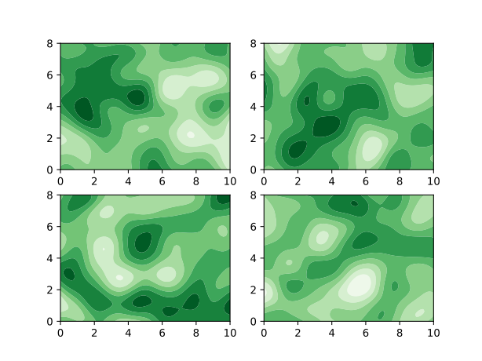
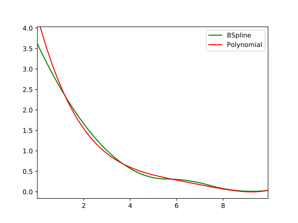
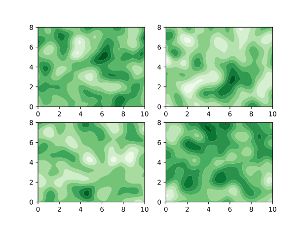
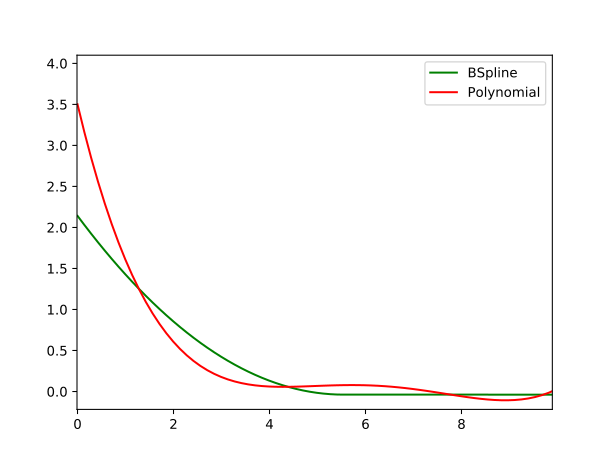
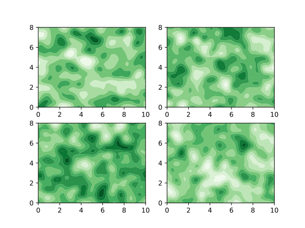
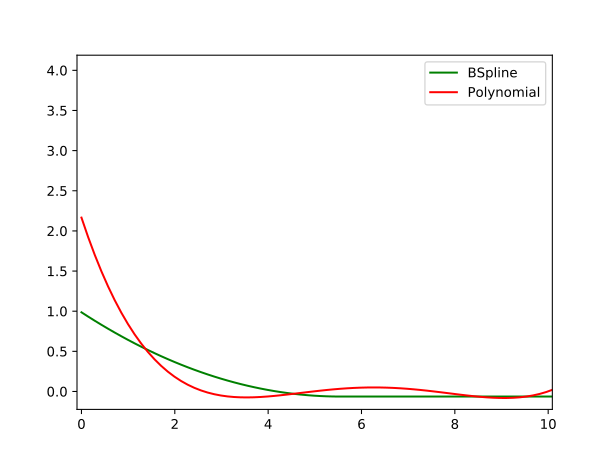
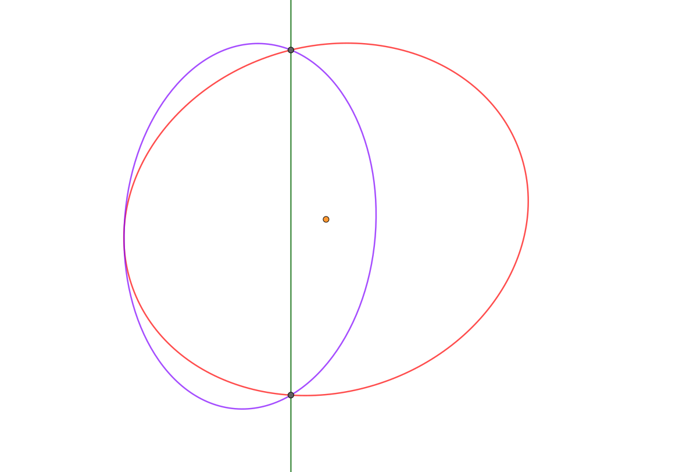
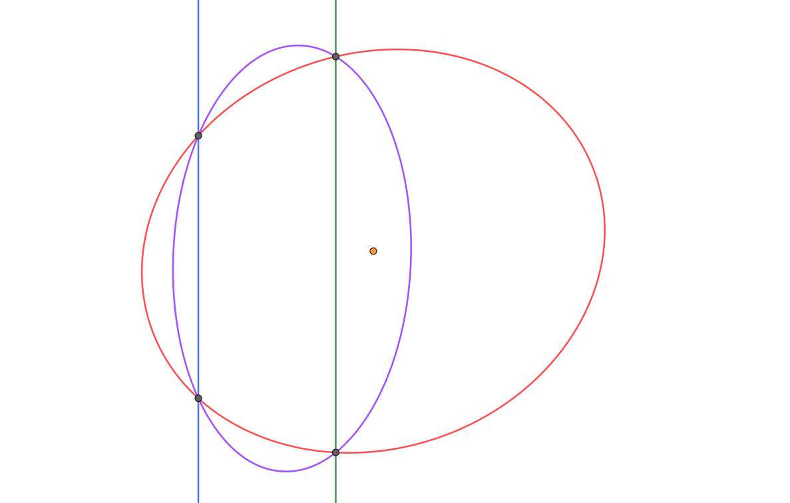
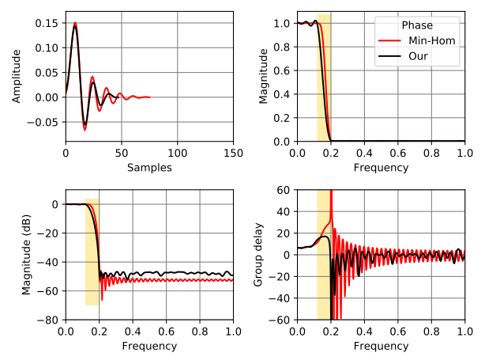
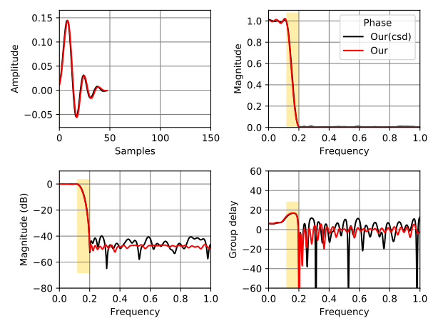

# Ellipsoid Method and Its Amazing Oracles 🔮

> When you have eliminated the impossible, whatever remains, however
> improbable, must be the truth.

Sir Arthur Conan Doyle, stated by Sherlock Holmes

# 📖 Introduction

## Common Perspective of Ellipsoid Method

- It is widely believed to be inefficient in practice for large-scale problems.

  - Convergent rate is slow, even when using deep cuts.

  - Cannot exploit sparsity.

- It has since then supplanted by the interior-point methods.

- Used only as a theoretical tool to prove polynomial-time solvability of some combinatorial optimization problems.

## But...

- The ellipsoid method works very differently compared with the interior point methods.

- It only requires a _separation oracle_ that provides a cutting plane.

- Although the ellipsoid method cannot take advantage of the sparsity of the problem, the separation oracle is capable of take advantage of certain structural types.

## Consider the ellipsoid method when...

- The number of design variables is moderate, e.g. ECO flow, analog circuit sizing, parametric problems

- The number of constraints is large, or even infinite

- Oracle can be implemented effectively.

# 🥥 Cutting-plane Method Revisited

## Convex Set

- Let $\mathcal{K} \subseteq \mathbb{R}^n$ be a convex set 🥚.
- Consider the feasibility problem:
  - Find a point $x^* \in \mathbb{R}^n$ in $\mathcal{K}$,
  - or determine that $\mathcal{K}$ is empty (i.e., there is no feasible solution)


## 🔮 Separation Oracle

- When a separation oracle $\Omega$ is _queried_ at $x_0$, it either
- asserts that $x_0 \in \mathcal{K}$, or
- returns a separating hyperplane between $x_0$ and $\mathcal{K}$:
  $$
  g^\mathsf{T} (x - x_0) + \beta \le 0, \\
    \beta \geq 0, g \neq 0, \; \forall x \in \mathcal{K}
  $$


## 🔮 Separation Oracle (cont'd)

- $(g, \beta)$ is called a _cutting-plane_, or cut, because it eliminates the half-space $\{x \mid g^\mathsf{T} (x - x_0) + \beta > 0\}$ from our search.

- If $\beta=0$ ($x_0$ is on the boundary of halfspace that is cut), the cutting-plane is called _neutral cut_.

- If $\beta>0$ ($x_0$ lies in the interior of halfspace that is cut), the cutting-plane is called _deep cut_.

- If $\beta<0$ ($x_0$ lies in the exterior of halfspace that is cut), the cutting-plane is called _shallow cut_.

## Subgradient

- $\mathcal{K}$ is usually given by a set of inequalities $f_j(x) \le 0$ or $f_j(x) < 0$ for $j = 1 \cdots m$, where $f_j(x)$ is a convex function.

- A vector $g \equiv \partial f(x_0)$ is called a subgradient of a convex function $f$ at $x_0$ if $f(z) \geq f(x_0) + g^\mathsf{T} (z - x_0)$.

- Hence, the cut $(g, \beta)$ is given by $(\partial f(x_0), f(x_0))$

Remarks:

- If $f(x)$ is differentiable, we can simply take $\partial f(x_0) = \nabla f(x_0)$

## Key components of Cutting-plane method

- A cutting plane oracle $\Omega$
- A search space $\mathcal{S}$ initially large enough to cover $\mathcal{K}$, e.g.
  - Polyhedron $\mathcal{P}$ = $\{z \mid C z \preceq d \}$
  - Interval $\mathcal{I}$ = $[l, u]$ (for one-dimensional problem)
  - Ellipsoid $\mathcal{E}$ = $\{z \mid (z-x_c)P^{-1}(z-x_c) \le 1 \}$

## Outline of Cutting-plane method

- Given initial $\mathcal{S}$ known to contain $\mathcal{K}$.
- Repeat
  - Choose a point $x_0$ in $\mathcal{S}$
  - Query the cutting-plane oracle at $x_0$
  - If $x_0 \in \mathcal{K}$, quit
  - Otherwise, update $\mathcal{S}$ to a smaller set that covers:
    $$\mathcal{S}^+ = \mathcal{S} \cap \{z \mid g^\mathsf{T} (z - x_0) + \beta \le 0\}$$
  - If $\mathcal{S}^+ = \emptyset$ or it is small enough, quit.

## Corresponding Python code

```python
def cutting_plane_feas(omega, space, options=Options()):
    for niter in range(options.max_iters):
        cut = omega.assess_feas(space.xc())  # query the oracle
        if cut is None:  # feasible sol'n obtained
            return space.xc(), niter
        status = space.update_deep_cut(cut)  # update space
        if status != CutStatus.Success or space.tsq() < options.tol:
            return None, niter
    return None, options.max_iters
```

## From Feasibility to Optimization

$$
\begin{array}{ll}
    \text{minimize}     & f_0(x), \\
    \text{subject to}   & x \in \mathcal{K}
\end{array}
$$

- The optimization problem is treated as a feasibility problem with an
  additional constraint $f_0(x) \le \gamma$.

- $f_0(x)$ could be a convex or a _quasiconvex function_.

- $\gamma$ is also called the _best-so-far_ value of
  $f_0(x)$.

## Convex Optimization Problem

- Consider the following general form:

  $$
  \begin{array}{ll}
    \text{minimize}     & \gamma, \\
    \text{subject to}   & \Phi(x, \gamma) \le 0, \\
    & x \in \mathcal{K},
  \end{array}
  $$

  where $\mathcal{K}'_\gamma = \{x \mid \Phi(x, \gamma) \le 0\}$
  is the $\gamma$-sublevel set of $\{x \mid f_0(x) \le \gamma\}$.

- 👉 Note: $\mathcal{K'}_\gamma \subseteq \mathcal{K'}_\epsilon$ if and only if
  $\gamma \le \epsilon$ (monotonicity)

- One easy way to solve the optimization problem is to apply the
  binary search on $\gamma$.

## Shrinking

- Another possible way is, to update the best-so-far
  $\gamma$ whenever a feasible solution $x'$ is found
  by solving the equation:
  $$\Phi(x', \gamma_\text{new}) = 0 \, .$$

- If the equation is difficuit to solve
  but $\gamma$ is also convex w.r.t. $\Phi$,
  then we may create a new varaible, say $z$
  and let $z \le \gamma$.

## Outline of Cutting-plane method (Optim)

- Given initial $\mathcal{S}$ known to contain
  $\mathcal{K}_\gamma$.
- Repeat
  - Choose a point $x_0$ in $\mathcal{S}$
  - Query the separation oracle at $x_0$
  - If $x_0 \in \mathcal{K}_\gamma$, update
    $\gamma$ such that
    $\Phi(x_0, \gamma) = 0$.
  - Update $\mathcal{S}$ to a smaller set that covers:
    $$\mathcal{S}^+ = \mathcal{S} \cap \{z \mid g^\mathsf{T} (z - x_0) + \beta \le 0\} $$
  - If $\mathcal{S}^+ = \emptyset$ or it is small enough, quit.

## Corresponding Python code

```python
def cutting_plane_optim(omega, S, gamma, options=Options()):
    x_best = None
    for niter in range(options.max_iters):
        cut, gamma1 = omega.assess_optim(space.xc(), gamma)
        if gamma1 is not None:  # better \gamma obtained
            gamma = gamma1
            x_best = copy.copy(space.xc())
            status = space.update_central_cut(cut)
        else:
            status = space.update_deep_cut(cut)
        if status != CutStatus.Success or space.tsq() < options.tol:
            return x_best, target, niter
    return x_best, gamma, options.max_iters
```

## Example - Profit Maximization Problem

This example is taken from [@Aliabadi2013Robust].

$$
\begin{array}{ll}
   \text{maximize} & p(A x_1^\alpha x_2^\beta) - v_1 x_1 - v_2 x_2 \\
   \text{subject to}& x_1 \le k.
\end{array}
$$

- $p(A x_1^\alpha x_2^\beta)$ : Cobb-Douglas production function
- $p$: the market price per unit
- $A$: the scale of production
- $\alpha, \beta$: the output elasticities
- $x$: input quantity
- $v$: output price
- $k$: a given constant that restricts the quantity of $x_1$

## Example - Profit maximization (cont'd)

- The formulation is not in the convex form.
- Rewrite the problem in the following form: $$\begin{array}{ll}
      \text{maximize} & \gamma \\
      \text{subject to} & \gamma  + v_1 x_1  + v_2 x_2 \le p A x_1^{\alpha} x_2^{\beta}\\
                    & x_1 \le k.
      \end{array}$$

## Profit maximization in Convex Form

- By taking the logarithm of each variable:

  - $y_1 = \log x_1$, $y_2 = \log x_2$.

- We have the problem in a convex form:

$$
\begin{array}{ll}
    \text{max}  & \gamma \\
    \text{s.t.} & \log(\gamma + v_1 e^{y_1} + v_2 e^{y_2}) - (\alpha y_1 + \beta y_2) \le \log(pA) \\
                & y_1 \le \log k.
\end{array}
$$

## Corresponding Python code

```python
class ProfitOracle:
    def __init__(self, params, elasticities, price_out):
        unit_price, scale, limit = params
        self.log_pA = math.log(unit_price * scale)
        self.log_k = math.log(limit)
        self.price_out = price_out
        self.el = elasticities

    def assess_optim(self, y, gamma):
        if (fj := y[0] - self.log_k) > 0.0:  # constraint
            return (np.array([1.0, 0.0]), fj), None

        log_Cobb = self.log_pA + self.el.dot(y)
        q = self.price_out * np.exp(y)
        qsum = q[0] + q[1]
        if (fj := math.log(gamma + qsum) - log_Cobb) > 0.0:
            return (q / (gamma + qsum) - self.el, fj), None

        Cobb = np.exp(log_Cobb) # shrinking
        return (q / Cobb - self.el, 0.0), Cobb - qsum
```

## Main program

```python
import numpy as np
from ellalgo.cutting_plane import cutting_plane_optim
from ellalgo.ell import Ell
from ellalgo.oracles.profit_oracle import ProfitOracle

p, A, k = 20.0, 40.0, 30.5
params = p, A, k
alpha, beta = 0.1, 0.4
v1, v2 = 10.0, 35.0
el = np.array([alpha, beta])
v = np.array([v1, v2])
r = np.array([100.0, 100.0])  # initial ellipsoid (sphere)

ellip = Ell(r, np.array([0.0, 0.0]))
omega = ProfitOracle(params, el, v)
xbest, \gamma, num_iters = cutting_plane_optim(omega, ellip, 0.0)
```

## Area of Applications

- Robust convex optimization
  - oracle technique: affine arithmetic
- Semidefinite programming
  - oracle technique: Cholesky or $LDL^\mathsf{T}$ factorization
- Parametric network potential problem
  - oracle technique: negative cycle detection

# Robust Convex Optimization

## Robust Optimization Formulation

- Consider:

  $$
  \begin{array}{ll}
    \text{minimize}   & \sup_{q \in \mathbb Q} f_0(x,q), \\
    \text{subject to} & f_j(x,q) \leq 0, \;
     \forall q \in {\mathbb Q}, \; j = 1,2,\cdots,m,
  \end{array}$$ where $q$ represents a set of varying parameters.
  $$

- The problem can be reformulated as:
  $$
  \begin{array}{ll}
    \text{minimize}   & \gamma \\
    \text{subject to} & f_0(x,q) < \gamma  \\
    & f_j(x,q) \leq 0, \;
     \forall q \in {\mathbb Q}, \; j = 1,2,\cdots,m.
  \end{array}
  $$

## Example - Profit Maximization Problem (convex)

$$
\begin{array}{ll}
\text{max}  & \gamma \\
\text{s.t.} & \log(\gamma + \hat{v}_1 e^{y_1} + \hat{v}_2 e^{y_2}) - (\hat{\alpha} y_1 + \hat{\beta} y_2) \le \log(\hat{p}\,A)  \\
                  & y_1 \le \log \hat{k} ,
\end{array}
$$

- Now assume that:
  - $\hat{\alpha}$ and $\hat{\beta}$ vary $\bar{\alpha} \pm e_1$ and
    $\bar{\beta} \pm e_2$ respectively.
  - $\hat{p}$, $\hat{k}$, $\hat{v}_1$, and $\hat{v}_2$ all vary
    $\pm e_3$.

## Example - Profit Maximization Problem (oracle)

By detail analysis, the worst case happens when:

- $p = \bar{p} - e_3$, $k = \bar{k} - e_3$
- $v_1 = \bar{v}_1 + e_3$, $v_2 = \bar{v}_2 + e_3$,
- if $y_1 > 0$, $\alpha = \bar{\alpha} - e_1$, else
  $\alpha = \bar{\alpha} + e_1$
- if $y_2 > 0$, $\beta = \bar{\beta} - e_2$, else
  $\beta = \bar{\beta} + e_2$

## Corresponding Python code

```python
class ProfitRbOracle(OracleOptim):
    def __init__(self, params, elasticities, price_out, vparams):
        e1, e2, e3, e4, e5 = vparams
        self.elasticities = elasticities
        self.e = [e1, e2]
        unit_price, scale, limit = params
        params_rb = unit_price - e3, scale, limit - e4
        self.omega = ProfitOracle(params_rb, elasticities,
                                  price_out + np.array([e5, e5]))

    def assess_optim(self, y, gamma):
        el_rb = copy.copy(self.elasticities)
        for i in [0, 1]:
            el_rb[i] += -self.e[i] if y[i] > 0.0 else self.e[i]
        self.omega.el = el_rb
        return self.omega.assess_optim(y, gamma)
```

## Oracle in Robust Optimization Formulation

- The oracle only needs to determine:
  - If $f_j(x_0, q) > 0$ for some $j$ and $q = q_0$,
    then
    - the cut $(g, \beta)$ =
      $(\partial f_j(x_0, q_0), f_j(x_0, q_0))$
  - If $f_0(x_0, q) \geq \gamma$ for some
    $q = q_0$, then
    - the cut $(g, \beta)$ =
      $(\partial f_0(x_0, q_0), f_0(x_0, q_0) - \gamma)$
  - Otherwise, $x_0$ is feasible, then
    - Let
      $q_{\max} = \text{argmax}_{q \in \mathbb Q} f_0(x_0, q)$.
    - $\gamma := f_0(x_0, q_{\max})$.
    - The cut $(g, \beta)$ =
      $(\partial f_0(x_0, q_{\max}), 0)$

Remark: for more complicated problems, affine arithmetic could be used [@liu2007robust].

# Matrix Inequalities

## Problems With Matrix Inequalities

Consider the following problem:

$$
\begin{array}{ll}
    \text{find}    & x, \\
    \text{subject to}  & F(x) \succ 0,
\end{array}
$$

- $F(x)$: a matrix-valued function
- $A \succ 0$ denotes $A$ is positive semidefinite.

## Problems With Matrix Inequalities

- Recall that a matrix $A$ is positive semidefinite if and only if
  $v^\mathsf{T} A v > 0$ for all $v \in \mathbb{R}^N - 0^N$.
- The problem can be transformed into: $$\begin{array}{ll}
              \text{find}      & x, \\
              \text{subject to}    & v^\mathsf{T} F(x) v > 0, \; \forall v \in \mathbb{R}^N - 0^N
      \end{array}$$
- Consider $v^\mathsf{T} F(x) v$ is
  concave for all $v \in \mathbb{R}^N$ w. r. t. $x$,
  then the above problem is a convex programming.
- Reduce to _semidefinite programming_ if
  $F(x)$ is linear w.r.t.
  $x$, i.e.,
  $F(x) = F_0 + x_1 F_1 + \cdots + x_n F_n$

## LDLT factorization

- The LDLT factorization of a symmetric positive definite matrix $A$ is the factorization
  $A = L D L^T$, where $L$ is lower triangular with unit diagonal elements and $D$ is a diagonal matrix.

- For example,
  $$
  \left[\begin{array}{cccc}
   1 & 1 & 1 & 1 \\
   1 & 2 & 1 & 2 \\
   1 & 1 & 3 & 1 \\
   1 & 2 & 1 & 4 \end{array}\right] =
  \left[\begin{array}{cccc}
   1 & 0 & 0 & 0 \\
   1 & 1 & 0 & 0 \\
   1 & 0 & 1 & 0 \\
   1 & 1 & 0 & 1 \end{array}\right]
  \left[\begin{array}{cccc}
   1 & 0 & 0 & 0 \\
   0 & 1 & 0 & 0 \\
   0 & 0 & 2 & 0 \\
   0 & 0 & 0 & 2 \end{array}\right]
  \left[\begin{array}{cccc}
   1 & 1 & 1 & 1 \\
   0 & 1 & 0 & 1 \\
   0 & 0 & 1 & 0 \\
   0 & 0 & 0 & 1
  \end{array}\right].
  $$

## Naïve implementation

- Then, start with $a_{11} = d_{11}$, the basic algorithm of LDLT factorization is:

$$
\begin{array}{l}
 1~ \text{for}~i=1:n \\
 2~     \quad \text{for}~  j=1:i-1 \\
 3~       \qquad s = a_{ij} - \sum_{k=1}^{j-1} d_{kk} l_{ik} l_{jk} \\
 4~       \qquad l_{ij} = s / d_{jj} \\
 5~     \quad \text{end} \\
 6~     \quad d_{ii} = a_{ii} - \sum_{k=1}^{j-1} d_{kk} l_{ik} l_{jk} \\
 7~ \text{end}
\end{array}
$$

- Invoke $p^3$ FLOP's, where $p$ is the place the algorithm stops.

## Storage representation

First, we pack the solution and the intermediate storage on a single matrix $T$ such that:

$$
t_{ij} = \begin{cases}
  d_{ii}        & \mathrm{if}\ i = j, \\
  l_{ij}        & \mathrm{if}\ i > j, \\
  d_{ii} l_{ji} & \mathrm{if}\ j < i.
\end{cases}
$$

- For example,
  $$
  T = \left[\begin{array}{cccc}
   d_{11} & d_{11} l_{21} & d_{11} l_{31} & d_{11} l_{41} \\
   l_{21} & d_{22} & d_{22} l_{32} & d_{22} l_{42} \\
   l_{31} & l_{32} & d_{33} & d_{33} l_{43} \\
   l_{41} & l_{42} & l_{43} & d_{44}
  \end{array}\right].
  $$

## Improved implementation

- Then, start with $a_{11} = t_{11}$, the improved implementation of LDLT factorization is:

$$
\begin{array}{l}
 1~ \text{for}~i=1:n  \\
 2~     \quad \text{for}~  j=1:i-1 \\
 3~       \qquad t_{ji} = a_{ij} - \sum_{k=1}^{j-1} t_{ik} t_{jk} \\
 4~       \qquad t_{ij} = t_{ji} / t_{jj} \\
 5~     \quad \text{end} \\
 6~     \quad t_{ii} = a_{ii} - \sum_{k=1}^{i-1} t_{ik} t_{ki} \\
 7~ \text{end}
\end{array}
$$

- Invoke $\frac{p^3}{2}$ FLOP's (same as Cholesky factorization's), where $p$ is the place the algorithm stops.

## Witness of indefiniteness

- In the case of failure, a vector $v$ can be constructed to certify that $v^T A v \leq 0$.

- Let $L_{1:p}$ denote the partial sub-matrix $L(1:p, 1:p)$ where $p$ is the row of failure.

- Then $v = [L_{1:p}^{-T} e_p, 0, \cdots, 0]^T$, where $e_p = [0, \cdots, 0, 1]^T \in \mathbb{R}^p$

- Start with $v = e_p$, the basic algorithm is:

$$
\begin{array}{l}
 1~ \text{for}~i = p - 1~\text{downto}~1 \\
 2~     \quad \text{for}~ k = i~\text{to}~p \\
 3~       \qquad v_i = v_i - t_{k,i} v_k \\
 4~     \quad \text{end} \\
 5~ \text{end}
\end{array}
$$

## Oracle in Matrix Inequalities

The oracle only needs to:

- Perform a _row-based_ LDLT factorization such that
  $F(x_0) = L D L^\mathsf{T}$.
- Let $A_{p,p}$ denotes a submatrix
  $A(1:p, 1:p) \in \mathbb{R}^{p\times p}$.
- If the process fails at row $p$,
  - there exists a vector
    $e_p = (0, 0, \cdots, 0, 1)^\mathsf{T} \in \mathbb{R}^p$, such
    that
    - $v = R_{p,p}^{-1} e_p$, and
    - $v^\mathsf{T} F_{p,p}(x_0) v \leq 0$.
  - The cut $(g, \beta)$ =
    $(-v^\mathsf{T} \partial F_{p,p}(x_0) v, -v^\mathsf{T} F_{p,p}(x_0) v)$

## Lazy evaluation

- Don't construct the full matrix at each iteration!

- Only O($p^3$) per iteration, independent of $N$!

```python
class LMIOracle:
    def __init__(self, F, B):
        self.F = F
        self.F0 = B
        self.Q = LDLTMgr(len(B))

    def assess_feas(self, x: Arr) -> Optional[Cut]:
        def get_elem(i, j):
            return self.F0[i, j] - sum(
                Fk[i, j] * xk for Fk, xk in zip(self.F, x))

        if self.Q.factor(get_elem):
            return None
        ep = self.Q.witness()
        g = np.array([self.Q.sym_quad(Fk) for Fk in self.F])
        return g, ep
```

## Google Benchmark 📊 Comparison

```bash
2: ----------------------------------------------------------
2: Benchmark                Time             CPU   Iterations
2: ----------------------------------------------------------
2: BM_LMI_Lazy         131235 ns       131245 ns         4447
2: BM_LMI_old          196694 ns       196708 ns         3548
2/4 Test #2: Bench_BM_lmi .....................   Passed    2.57 sec
```

## Example - Matrix Norm Minimization

- Let $A(x) = A_0 + x_1 A_1 + \cdots + x_n A_n$
- Problem $\min_x \| A(x) \|$ can be reformulated as
  $$
  \begin{array}{ll}
       \text{minimize}      & \gamma, \\
       \text{subject to}    & \left(
   \begin{array}{cc}
    \gamma\,I   & A(x) \\
    A^\mathsf{T}(x) & \gamma\,I
   \end{array} \right) \succ 0,
   \end{array}
  $$
- Binary search on $\gamma$ can be used for this problem.

## Example - Estimation of Correlation Function

$$
\begin{array}{ll}
   \min_{{\color{blue}\kappa}, p}   & \| \Sigma({\color{blue}p}) + {\color{blue}\kappa} I - Y \| \\
   \text{s. t.} & \Sigma({\color{blue}p}) \succ 0,  {\color{blue}\kappa} \geq 0 \; .\\
 \end{array}
$$

- Let $\rho(h) = \sum_i^n {\color{blue}p}_i \Psi_i(h)$, where

  - $p_i$'s are the unknown coefficients to be fitted
  - $\Psi_i$'s are a family of basis functions.

- The covariance matrix $\Sigma({\color{blue}p})$ can be recast as:
  $$\Sigma({\color{blue}p}) = {\color{blue}p}_1 F_1 + \cdots + {\color{blue}p}_n F_n$$

  where $\{F_k\}_{i,j} =\Psi_k( \| s_j - s_i \|_2)$

## 🧪 Experimental Result


: Data Sample (kern=0.5)


: Least Square Result

## 🧪 Experimental Result II


: Data Sample (kern=1.0)



## 🧪 Experimental Result III


: Data Sample (kern=2.0)


: Least Square Result

# Multi-parameter Network Problem

## Parametric Network Problem

Given a network represented by a directed graph $G = (V, E)$.

Consider:

$$
\begin{array}{ll}
    \text{find} & x, {\color{red}u} \\
    \text{subject to} & {\color{red}u_j} - {\color{red}u_i} \le h_{ij}(x), \; \forall (i, j) \in E ,
   \end{array}
$$

- $h_{ij}(x)$ is the concave function of
  edge $(i,j)$,

- Assume: network is large, but the number of parameters is small.

## Network Potential Problem (cont'd)

Given $x$, the problem has a feasible solution if and only if
$G$ contains no negative cycle. Let $\mathcal{C}$ be a set of all cycles
of $G$.

$$
\begin{array}{ll}
    \text{find} & x \\
    \text{subject to} & w_k(x) \ge 0, \forall C_k \in \mathcal{C} ,
\end{array}
$$

- $C_k$ is a cycle of $G$

- $w_k(x) = \sum_{ (i,j)\in C_k} h_{ij}(x)$.

## Negative Cycle Finding

There are lots of methods to detect negative
cycles in a weighted graph [@cherkassky1999negative], in which Tarjan's
algorithm [@Tarjan1981negcycle] is one of the fastest algorithms in
practice [@alg:dasdan_mcr; @cherkassky1999negative].

## Oracle in Network Potential Problem

- The oracle only needs to determine:
  - If there exists a negative cycle $C_k$ under $x_0$, then
    - the cut $(g, \beta)$ = $(-\partial w_k(x_0), -w_k(x_0))$
  - Otherwise, the shortest path solution gives the value of ${\color{red}u}$.

## Python Code

```python
class NetworkOracle:
    def __init__(self, G, u, h):
        self._G = G
        self._u = u
        self._h = h
        self._S = NegCycleFinder(G)

    def update(self, gamma):
        self._h.update(gamma)

    def assess_feas(self, x) -> Optional[Cut]:
        def get_weight(e):
            return self._h.eval(e, x)

        for Ci in self._S.find_neg_cycle(self._u, get_weight):
            f = -sum(self._h.eval(e, x) for e in Ci)
            g = -sum(self._h.grad(e, x) for e in Ci)
            return g, f  # use the first Ci only
        return None
```

## Example - Optimal Matrix Scaling [@orlin1985computing]

- Given a sparse matrix $A = [a_{ij}] \in \mathbb{R}^{N\times N}$.

- Find another matrix $B = U A U^{-1}$ where $U$ is a nonnegative
  diagonal matrix, such that the ratio of any two elements of $B$ in
  absolute value is as close to 1 as possible.

- Let $U = \mathrm{diag}([u_1, u_2, \ldots, u_N])$. Under the
  min-max-ratio criterion, the problem can be formulated as:

$$
\begin{array}{ll}
  \text{minimize}   &   \pi/\psi  \\
  \text{subject to} &   \psi \le u_i |a_{ij}| u_j^{-1} \le \pi, \; \forall a_{ij} \neq 0 , \\
                    &   \pi, \psi, u, \, \text{positive} \\
  \text{variables}  &   \pi, \psi, u \, .
  \end{array}
$$

## Optimal Matrix Scaling (cont'd)

By taking the logarithms of variables, the above problem can be
transformed into:

$$
\begin{array}{ll}
  \text{minimize}   &   \gamma \\
  \text{subject to} &   {\color{blue}\pi'} - {\color{blue}\psi'} \le \gamma \\
                    &   {\color{red}u_i'} - {\color{red}u_j'}  \le {\color{blue}\pi'} - a_{ij}', \; \forall a_{ij} \neq 0 \,, \\
                    &   {\color{red}u_j'} - {\color{red}u_i'} \le a_{ij}' - {\color{blue}\psi'}, \; \forall a_{ij} \neq 0 \,, \\
  \text{variables}  &   {\color{blue}\pi'}, {\color{blue}\psi'}, {\color{red}u'} \, .
  \end{array}
$$

where $k'$ denotes $\log( | k | )$ and
$x = ({\color{blue}\pi'}, {\color{blue}\psi'} )^\mathsf{T}$.

```python
class OptScalingOracle:
    class Ratio:
        def __init__(self, G, get_cost):
            self._G = G
            self._get_cost = get_cost

        def eval(self, e, x: Arr) -> float:
            u, v = e
            cost = self._get_cost(e)
            return x[0] - cost if u < v else cost - x[1]

        def grad(self, e, x: Arr) -> Arr:
            u, v = e
            return np.array([1.0, 0.0] if u < v else [0.0, -1.0])

    def __init__(self, G, u, get_cost):
        self._network = NetworkOracle(G, u, self.Ratio(G, get_cost))

    def assess_optim(self, x: Arr, gamma: float):
        s = x[0] - x[1]
        g = np.array([1.0, -1.0])
        if (fj := s - gamma) >= 0.0:
            return (g, fj), None
        if (cut := self._network.assess_feas(x)):
            return cut, None
        return (g, 0.0), s
```

## Example - clock period & yield-driven co-optimization

$$
\begin{array}{cll}
   \text{minimize} &T_\text{CP} / \beta \\
   \text{subject to} & u_i - u_j \le T_\text{CP} - F_{ij}^{-1}(\beta), & \forall (i,j) \in E_s \,,\\
                     & u_j - u_i \le F_{ij}^{-1}(1 - \beta), & \forall (j,i) \in E_h \,, \\
                     & T_\text{CP} \ge 0, \, 0 \le \beta \le 1 \, , \\
    \text{variables} &T_\text{CP}, \beta, u.
   \end{array}
$$

- 👉 Note that $F_{ij}^{-1}(x)$ is not concave in general in $[0, 1]$.
- Fortunately, we are most likely interested in optimizing circuits
  for high yield rather than the low one in practice.
- Therefore, by imposing an additional constraint to $\beta$, say
  $\beta \geq 0.8$, the problem becomes convex.

## Example - clock period & yield-driven co-optimization

The problem can be reformulated as:

$$
\begin{array}{cll}
   \text{minimize}   & \gamma \\
   \text{subject to} & T_\text{CP} - \beta \gamma \le 0\\
                     & u_i - u_j \le T_\text{CP} - F_{ij}^{-1}(\beta), & \forall (i,j) \in E_s \,,\\
                     & u_j - u_i \le F_{ij}^{-1}(1 - \beta), & \forall (j,i) \in E_h \,, \\
                     & T_\text{CP} \ge 0, \, 0 \le \beta \le 1 \, , \\
    \text{variables} &T_\text{CP}, \beta, u.
   \end{array}
$$

# 🏉 Ellipsoid Method Revisited

## 📝 Abstract

This lecture provides a brief history of the ellipsoid method. Then it discusses implementation issues of the ellipsoid method, such as utilizing parallel cuts to update the search space and enhance computation time. In some instances, parallel cuts can drastically reduce computation time, as observed in FIR filter design. Discrete optimization is also investigated, illustrating how the ellipsoid method can be applied to problems that involve discrete design variables. An oracle implementation is required solely for locating the nearest discrete solutions

## Some History of Ellipsoid Method [@BGT81]

- Introduced by Shor and Yudin and Nemirovskii in 1976

- Used to show that linear programming (LP) is polynomial-time
  solvable (Kachiyan 1979), settled the long-standing problem of
  determining the theoretical complexity of LP.

- In practice, however, the simplex method runs much faster than the
  method, although its worst-case complexity is exponential.

## Basic Ellipsoid Method

- An ellipsoid $\mathcal{E}(x_c, P)$ is specified as a set
  $$\{x \mid (x-x_c)P^{-1}(x-x_c) \le 1 \},$$
  where $x_c$ is the center of the ellipsoid.


## Updating the ellipsoid (deep-cut)

Calculation of minimum volume ellipsoid ${\color{violet} \mathcal{E}^+}$ covering:

$$
{\color{red} \mathcal{E} } \cap
 \{z \mid {\color{green} g^\mathsf{T} } (z - {\color{orange} x_c}) + {\color{green} \beta} \le 0 \}.
$$



## Updating the ellipsoid (deep-cut)

- Let $\tilde{g} = P\,g$, $\tau^2 = g^\mathsf{T} P g$.

- If $\tau + n \cdot \beta < 0$ (shallow cut), no smaller ellipsoid can be found.

- If $\beta > \tau$, intersection is empty.

Otherwise,

$$
x_c^+ = x_c - \frac{\rho}{ \tau^2 } \tilde{g}, \quad
  P^+ = \delta\cdot\left(P - \frac{\sigma}{\tau^2} \tilde{g}\tilde{g}^\mathsf{T}\right).
$$

where

$$
\rho = \frac{ \tau+n \cdot \beta}{n+1}, \quad
  \sigma = \frac{2\rho}{ \tau + \beta}, \quad
  \delta = \frac{n^2(\tau + \beta)(\tau - \beta)}{(n^2 - 1)\tau^2}.
$$

## Updating the ellipsoid (cont'd)

- Even better, split $P$ into two variables $\kappa \cdot Q$

- Let $\tilde{g} = Q \cdot g$, $\omega = g^\mathsf{T}\tilde{g}$, $\tau = \sqrt{\kappa\cdot\omega}$.

  $$
  x_c^+ = x_c - \frac{\rho}{\omega} \tilde{g}, \quad
  Q^+ = Q - \frac{\sigma}{\omega} \tilde{g}\tilde{g}^\mathsf{T}, \quad
  \kappa^+ =  \delta\cdot\kappa.
  $$

- Reduce $n^2$ multiplications per iteration.

- 👉 Note:

  - The determinant of $Q$ decreases monotonically.
  - The range of $\delta$ is $(0, \frac{n^2}{n^2 - 1})$.

## Central Cut

- A Special case of deep cut when $\beta = 0$

- Deserve a separate implement because it is much simplier.

- Let $\tilde{g} = Q\,g$, $\tau = \sqrt{\kappa\cdot\omega}$,

$$
\rho = \frac{\tau}{n+1}, \quad
  \sigma = \frac{2}{n+1}, \quad
  \delta = \frac{n^2}{n^2 - 1}.
$$

## Central Cut

Calculation of minimum volume ellipsoid ${\color{violet} \mathcal{E}^+}$ covering:

$$
{\color{red} \mathcal{E} } \cap
 \{z \mid {\color{green} g^\mathsf{T} } (z - {\color{orange} x_c}) \le 0 \}.
$$


# Parallel Cuts

## Parallel Cuts

- Oracle returns a pair of cuts instead of just one.

- The pair of cuts is given by $g$ and $({\color{green} \beta_0}, {\color{blue} \beta_1})$ such that:

  $$
  \begin{array}{l}
  {\color{green} g^\mathsf{T} } (x - {\color{orange} x_c}) + {\color{green} \beta_0} \leq 0, \\
  {\color{blue} g^\mathsf{T} } (x - {\color{orange} x_c}) + {\color{blue} \beta_1} \geq 0,
  \end{array}$$ for all $x \in \mathcal{K}$.
  \$\$
  $$

- Only linear inequality constraint can produce such parallel cut:
  $$ l \le a^\mathsf{T} x + b \le u, \quad L \preceq F(x) \preceq U. $$

- Usually provide faster convergence.

## Parallel Cuts

Calculation of minimum volume ellipsoid ${\color{violet} \mathcal{E}^+}$ covering:

$$
{\color{red} \mathcal{E} } \cap
 \{z \mid {\color{green} g^\mathsf{T} } (z - {\color{orange} x_c}) + {\color{green} \beta_0} \le 0 \\
            \land {\color{blue} g^\mathsf{T} } (z - {\color{orange} x_c}) + {\color{blue} \beta_1} \ge 0  \}.
$$



## Updating the ellipsoid (old)

- Let $\tilde{g} = Q\,g$, $\tau^2 = \kappa\cdot\omega$.
- If $\beta_0 > \beta_1$, intersection is empty.
- If $\beta_0 \beta_1 \leq -\tau^2/n$, no smaller ellipsoid can be found.
- If $\beta_1^2 > \tau^2$, it reduces to deep-cut with $\beta = \beta_1$
- Otherwise,
  $$
  x^+_c = x_c - \frac{\rho}{\omega} \tilde{g}, \quad
  Q^+ = Q - \frac{\sigma}{\omega} \tilde{g}\tilde{g}^\mathsf{T}, \quad
  \kappa^+ =  \delta \kappa.
  $$
  where
  $$
  \begin{array}{lll}
    \zeta_0 &=& \tau^2 - \beta_0^2 \\
    \zeta_1 &=& \tau^2 - \beta_1^2 \\
    \xi &=& \sqrt{4\zeta_0\zeta_1 + n^2(\beta_1^2 - \beta_0^2)^2}, \\
    \sigma &=& (n + (2\tau^2 + 2\beta_0\beta_1 - \xi)\{\color{red}(\beta_0 + \beta_1)^2} ) / (n + 1), \\
    \rho &=& \sigma(\beta_0 + \beta_1) / 2, \\
    \delta &=& (n^2/2(n^2-1)) (\zeta_0 + \zeta_1 + \xi/n) / \tau^2 .
   \end{array}
  $$

## Updating the ellipsoid (new)

- Let $\tilde{g} = Q\,g$, $\tau^2 = \kappa\cdot\omega$.
- If $\beta_0 > \beta_1$, intersection is empty.
- If $\tau^2 + n \beta_0 \beta_1 \leq 0$, no smaller ellipsoid can be found.
- If $\beta_1^2 > \tau^2$, it reduces to deep-cut with $\beta = \beta_1$
- Otherwise,
  $$
  x^+_c = x_c - \frac{\rho}{\omega} \tilde{g}, \quad
  Q^+ = Q - \frac{\sigma}{\omega} \tilde{g}\tilde{g}^\mathsf{T}, \quad
  \kappa^+ =  \delta \kappa.
  $$
  where
  $$
  \begin{array}{lll}
    \eta &=& \tau^2 + n \beta_0 \beta_1 \\
    \bar{\beta} &=& (\beta_0 + \beta_1) / 2 \\
    h &=& \frac{1}{2}(\tau^2 + \beta_0\beta_1) + n \bar{\beta}^2, \\
    k &=& h + \sqrt{h^2 - (n + 1) \eta \bar{\beta}^2}, \\
    \sigma &=& \eta / k, \quad \rho = \sigma \bar{\beta}, \\
    \delta &=& 1 + \frac{\eta}{\tau^2(k - \eta)} (\bar{\beta}^2 \sigma - \beta_0\beta_1).
   \end{array}
  $$

## Parallel Central Cuts

Calculation of minimum volume ellipsoid ${\color{violet} \mathcal{E}^+}$ covering:

$$
{\color{red} \mathcal{E} } \cap
 \{z \mid {\color{green} g^\mathsf{T} } (z - {\color{orange} x_c}) \le 0 \\
            \land {\color{blue} g^\mathsf{T} } (z - {\color{orange} x_c}) + {\color{blue} \beta_1} \ge 0  \}.
$$

## Updating the ellipsoid

- Let $\tilde{g} = Q\,g$, $\tau^2 = \kappa\cdot\omega$.
- If $\beta_1^2 > \tau^2$, it reduces to central-cut
- Otherwise,
  $$
  x^+_c = x_c - \frac{\rho}{\omega} \tilde{g}, \quad
  Q^+ = Q - \frac{\sigma}{\omega} \tilde{g}\tilde{g}^\mathsf{T}, \quad
  \kappa^+ =  \delta \kappa.
  $$
  where
  $$
  \begin{array}{lll}
    \alpha^2 &=& \beta^2 / \tau^2 \\
    h &=& \frac{n}{2} \alpha^2 \\
    r &=& h + \sqrt{h^2 + 1 - \alpha^2}, \\
    \rho &=& \frac{\beta}{r + 1} \\
    \sigma &=& \frac{2}{r + 1}, \\
    \delta &=& \frac{r}{r - 1/n}.
   \end{array}
  $$

## Example - FIR filter design


- The time response is:
  $$y[t] = \sum_{k=0}^{n-1}{h[k]u[t-k]}. $$

## Example - FIR filter design (cont'd)

- The frequency response:
  $$H(\omega)~=~\sum_{m=0}^{n-1}{h(m)e^{-jm\omega} }. $$

- The magnitude constraints on frequency domain are expressed as

  $$L(\omega)~\leq~|H(\omega)|~\leq~U(\omega),~\forall~\omega\in(-\infty,+\infty). $$

  where $L(\omega)$ and $U(\omega)$ are the lower and
  upper (nonnegative) bounds at frequency $\omega$ respectively.

- The constraint is non-convex in general.

## Example - FIR filter design (II)

- However, via *spectral factorization* [@goodman1997spectral], it can transform into a convex one [@wu1999fir]:
  $$L^2(\omega)~\leq~R(\omega)~\leq~U^2(\omega),~\forall~\omega\in(0,\pi), $$

  where

  - $R(\omega)=\sum_{i=-1+n}^{n-1}{r(t)e^{-j{\omega}t} }=|H(\omega)|^2$
  - $\mathbf{r}=(r(-n+1),r(-n+2),...,r(n-1))$ are the
    autocorrelation coefficients.

## Example - FIR filter design (III)

- $\mathbf{r}$ can be determined by $\mathbf{h}$:

  $$r(t)~=~\sum_{i=-n+1}^{n-1}{h(i)h(i+t)},~t\in\mathbf{Z}, $$

  where $h(t)=0$ for $\gamma < 0$ or $\gamma > n - 1$.

- The whole problem can be formulated as:

$$
\begin{array}{ll}
  \text{min}  & \gamma \\
  \text{s.t.} & L^2(\omega) \le R(\omega) \le U^2(\omega), \; \forall \omega \in [0,\pi]   \\
              & R(\omega) > 0, \forall \omega \in [0,\pi]
\end{array}
$$

#🧪 Experiment



## 📊 Google Benchmark Result

```bash
3: ------------------------------------------------------------------
3: Benchmark                        Time             CPU   Iterations
3: ------------------------------------------------------------------
3: BM_Lowpass_single_cut    627743505 ns    621639313 ns            1
3: BM_Lowpass_parallel_cut   30497546 ns     30469134 ns           24
3/4 Test #3: Bench_BM_lowpass .................   Passed    1.72 sec
```

# Discrete Optimization

## Why Discrete Convex Programming

- Many engineering problems can be formulated as a convex/geometric
  programming, e.g. digital circuit sizing

- Yet in an ASIC design, often there is only a limited set of choices
  from the cell library. In other words, some design variables
  are discrete.

- The discrete version can be formulated as a _Mixed-Integer Convex
  programming_ (MICP) by mapping the design variables to integers.

## What's Wrong w/ Existing Methods?

- Mostly based on relaxation.

- Then use the relaxed solution as a lower bound and use the
  branch--and--bound method for the discrete optimal solution.

  - 👉 Note: the branch-and-bound method does not utilize the convexity
    of the problem.

- What if I can only evaluate constraints on discrete data?
  Workaround: convex fitting?

## Mixed-Integer Convex Programming

Consider:

$$
\begin{array}{ll}
        \text{minimize}      & f_0(x), \\
        \text{subject to}    & f_j(x) \le 0, \; \forall j=1,2,\ldots \\
                             & x \in \mathbb{D}
\end{array}
$$

where

- $f_0(x)$ and $f_j(x)$ are "convex"
- Some design variables are discrete.

## Oracle Requirement

- The oracle looks for the nearby discrete solution ${\color{magenta} x_d}$ of ${\color{orange} x_c}$
  with the cutting-plane:
  $$g^\mathsf{T} (x - {\color{magenta}x_d}) + \beta \le 0, \beta \ge 0, g \neq 0$$

- 👉 Note: the cut may be a shallow cut.

- Suggestion: use different cuts as possible for each iteration
  (e.g. round-robin the evaluation of constraints)

## Discrete Cut


## Example - Multiplier-less FIR filter design (nnz=3)


